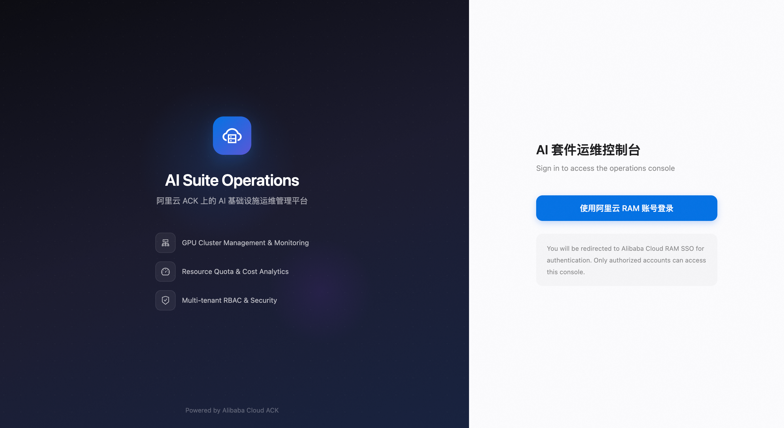

# 部署指南：在 ACK 上安装 AI 开发平台

本文介绍如何在阿里云容器服务 ACK（Kubernetes）集群上部署 data-on-ack AI 开发平台，包含运维控制台（ai-dashboard）和开发控制台（ai-dev-console）。

## 前提条件

| 条件 | 说明 |
|------|------|
| ACK Pro 集群 | 版本 >= 1.20，已安装 Nginx Ingress Controller |
| Helm 3 | 本地已安装 helm CLI |
| kubectl | 已配置 kubeconfig 连接到目标集群 |
| 阿里云账号 | 主账号或具有 RAM/IMS 权限的子账号 |
| Prometheus 监控 | 集群已开启 ARMS Prometheus 监控 |

## 架构概览

```
                    ┌─────────────────────────────────────┐
                    │          ACK Pro Cluster            │
                    │                                     │
  用户浏览器 ──────▶│  Nginx Ingress                      │
                    │    ├── /  → ai-dashboard (:8080)    │
                    │    └── /  → ai-dev-console (:9090)  │
                    │                                     │
                    │  ai-dashboard (运维控制台)           │
                    │    ├── 用户/配额/数据集管理          │
                    │    ├── Grafana 监控面板              │
                    │    └── Node Shell 运维              │
                    │                                     │
                    │  ai-dev-console (开发控制台)         │
                    │    ├── Notebook (Jupyter/VSCode)     │
                    │    ├── 训练任务管理                  │
                    │    ├── 模型推理服务                  │
                    │    └── 实验跟踪                      │
                    │                                     │
                    │  notebook-controller                │
                    │  commit-agent (DaemonSet)           │
                    └─────────────────────────────────────┘
```

## 步骤一：阿里云 RAM 授权配置

AI 控制台需要调用阿里云 IMS API 管理 OAuth 登录应用，因此需要为集群的 Worker 角色授权。

### 1.1 创建自定义权限策略

登录 [RAM 控制台](https://ram.console.aliyun.com) > 权限管理 > 权限策略 > 创建权限策略：

- 策略名称：`k8sWorkerRolePolicy-<ClusterID>`（将 `<ClusterID>` 替换为实际集群 ID）
- 策略内容：

```json
{
  "Version": "1",
  "Statement": [
    {
      "Effect": "Allow",
      "Action": [
        "ims:CreateApplication",
        "ims:UpdateApplication",
        "ims:GetApplication",
        "ims:ListApplications",
        "ims:DeleteApplication",
        "ims:CreateAppSecret",
        "ims:GetAppSecret",
        "ims:ListAppSecretIds",
        "ims:ListUsers"
      ],
      "Resource": "*"
    }
  ]
}
```

### 1.2 为集群 Worker 角色授权

1. 在 RAM 控制台 > 身份管理 > 角色，搜索 `KubernetesWorkerRole-<ClusterID>`
2. 为该角色添加上一步创建的策略 `k8sWorkerRolePolicy-<ClusterID>`

> **说明**：如果使用 RRSA（推荐），则对 ServiceAccount 绑定的 RAM Role 授权即可，无需修改 Worker Role。

## 步骤二：获取 AccessKey

控制台需要 AK/SK 来调用阿里云 IMS API 创建 OAuth 应用。

1. 登录 [RAM 控制台](https://ram.console.aliyun.com) > AccessKey 管理
2. 创建 AccessKey（推荐使用 RAM 子账号的 AK，并仅授予 IMS 权限）
3. 记录 `AccessKeyId` 和 `AccessKeySecret`

> **安全提示**：请勿将 AK/SK 存入代码仓库或 values.yaml。后续步骤通过 Kubernetes Secret 注入。

## 步骤三：创建 Kubernetes Secret

```bash
# 创建命名空间
kubectl create ns kube-ai

# 运维控制台凭据
kubectl create secret generic ai-dashboard-credentials \
  --from-literal=accessKeyId=<YOUR_AK> \
  --from-literal=accessKeySecret=<YOUR_SK> \
  -n kube-ai

# 开发控制台凭据
kubectl create secret generic ai-dev-console-credentials \
  --from-literal=accessKeyId=<YOUR_AK> \
  --from-literal=accessKeySecret=<YOUR_SK> \
  -n kube-ai
```

（可选）创建 Session Secret 以使 Pod 重启后会话不丢失：

```bash
kubectl create secret generic ai-dashboard-auth \
  --from-literal=sessionSecret=$(openssl rand -hex 32) \
  -n kube-ai

kubectl create secret generic ai-dev-console-auth \
  --from-literal=sessionSecret=$(openssl rand -hex 32) \
  -n kube-ai
```

## 步骤四：获取 Prometheus 内网地址

Grafana 监控面板需要 ARMS Prometheus 数据源地址：

1. 登录 [ACK 控制台](https://cs.console.aliyun.com) > 集群详情 > 运维管理 > Prometheus 监控
2. 点击"设置"，复制 **HTTP API 地址（内网）**
3. 地址格式：`http://cn-<region>-intranet.arms.aliyuncs.com:9090/api/v1/prometheus/<实例ID>/<UID>/<集群ID>/<region>`

> **说明**：如果集群未开启 Prometheus 监控，可在 ACK 控制台 > 运维管理 > Prometheus 监控 中开启。

## 步骤五：安装运维控制台（ai-dashboard）

```bash
helm install ai-dashboard charts/ack-ai-dashboard \
  -n kube-ai \
  --set 'admin-ui.dashboard.ingress.hosts[0].host=<YOUR_DASHBOARD_DOMAIN>' \
  --set 'admin-ui.dashboard.ingress.hosts[0].paths[0]=/' \
  --set admin-ui.auth.existingSecret=ai-dashboard-auth \
  --set grafana.adminPassword=<YOUR_GRAFANA_PASSWORD> \
  --set 'grafana.datasources.datasources\.yaml.datasources[0].url=<PROMETHEUS_URL>'
```

**参数说明：**

| 参数 | 必填 | 说明 |
|------|------|------|
| `admin-ui.dashboard.ingress.hosts[0].host` | 是 | Ingress 域名，如 `ai-dashboard.example.com` |
| `grafana.datasources.datasources\.yaml.datasources[0].url` | 是 | ARMS Prometheus 内网地址（步骤四获取） |
| `grafana.adminPassword` | 是 | Grafana 管理员密码 |
| `admin-ui.auth.existingSecret` | 否 | Session 持久化 Secret 名称 |
| `admin-ui.dashboard.intlAccount` | 否 | 国际站账号设为 `"true"` |
| `admin-ui.dashboard.credentialMode` | 否 | `static`(AK/SK) 或 `rrsa` |

### 验证部署

```bash
kubectl get pods -n kube-ai -l app.kubernetes.io/name=admin-ui
# 期望：1/1 Running

curl -s -o /dev/null -w '%{http_code}' http://<YOUR_DASHBOARD_DOMAIN>/health
# 期望：200
```

## 步骤六：安装开发控制台（ai-dev-console）

```bash
helm install ai-dev-console charts/ack-ai-dev-console \
  -n kube-ai \
  --set 'dev-console.console.ingress.hosts[0].host=<YOUR_CONSOLE_DOMAIN>' \
  --set 'dev-console.console.ingress.hosts[0].paths[0]=/' \
  --set dev-console.auth.existingSecret=ai-dev-console-auth
```

**参数说明：**

| 参数 | 必填 | 说明 |
|------|------|------|
| `dev-console.console.ingress.hosts[0].host` | 是 | Ingress 域名，如 `ai-dev.example.com` |
| `dev-console.auth.existingSecret` | 否 | Session 持久化 Secret 名称 |
| `dev-console.console.intlAccount` | 否 | 国际站账号设为 `"true"` |
| `dev-console.console.credentialMode` | 否 | `static`(AK/SK) 或 `rrsa` |

### 验证部署

```bash
kubectl get pods -n kube-ai -l app.kubernetes.io/name=dev-console
# 期望：1/1 Running

curl -s -o /dev/null -w '%{http_code}' http://<YOUR_CONSOLE_DOMAIN>/health
# 期望：200
```

## 步骤七：配置域名解析

### 方式一：公网域名（测试用）

1. 获取 Nginx Ingress 的 SLB 公网 IP：
   ```bash
   kubectl get svc -n kube-system nginx-ingress-lb -o jsonpath='{.status.loadBalancer.ingress[0].ip}'
   ```
2. 在本地 `/etc/hosts` 添加：
   ```
   <SLB_IP> ai-dashboard.example.com
   <SLB_IP> ai-dev.example.com
   ```

### 方式二：私网域名（生产环境推荐）

1. 获取 Nginx Ingress 的 SLB 私网 IP
2. 在企业 DNS 或阿里云 PrivateZone 中配置域名解析

## 步骤八：配置 OAuth 回调地址（自动完成）

控制台启动时会自动通过 IMS API 创建 RAM OAuth2 Web 应用并设置回调地址。回调地址格式为：

- 运维控制台：`http://<YOUR_DASHBOARD_DOMAIN>/login/aliyun`
- 开发控制台：`http://<YOUR_CONSOLE_DOMAIN>/api/v1/login/aliyun/callback`

如需手动管理 OAuth 应用（如配置多个回调地址、更换域名等），请参阅：
- [创建 RAM OAuth 应用](https://help.aliyun.com/zh/ram/create-an-application)

> **说明**：如果设置 `createWebApp: false`，则需要手动在 RAM 控制台创建 OAuth 应用并配置回调地址。

## 步骤九：访问控制台

- 运维控制台：`http://<YOUR_DASHBOARD_DOMAIN>/`
- 开发控制台：`http://<YOUR_CONSOLE_DOMAIN>/`

首次访问会重定向到阿里云 RAM SSO 登录页面：



使用阿里云账号登录即可：

- **主账号登录**：自动获得 admin 角色
- **RAM 子账号登录**：获得 researcher 角色

登录成功后进入控制台首页：


## 自行构建镜像（可选）

如果不使用预构建镜像，可以自行构建：

```bash
# 运维控制台
cd ai-dashboard
docker build -t <your-registry>/ai-dashboard:latest .
docker push <your-registry>/ai-dashboard:latest

# 开发控制台
cd ai-dev-console
docker build -f Dockerfile.console-new -t <your-registry>/ai-dev-console:latest .
docker push <your-registry>/ai-dev-console:latest
```

安装时通过 `--set` 指定镜像：

```bash
helm install ai-dashboard charts/ack-ai-dashboard -n kube-ai \
  --set admin-ui.image.repository=<your-registry>/ai-dashboard \
  --set admin-ui.image.tag=latest \
  ...
```

## 参考文档

- [创建 ACK Pro 集群](https://help.aliyun.com/zh/ack/ack-managed-and-ack-dedicated/user-guide/create-an-ack-managed-cluster-2)
- [RAM 权限策略管理](https://help.aliyun.com/zh/ram/user-guide/create-a-custom-policy)
- [创建 RAM OAuth 应用](https://help.aliyun.com/zh/ram/create-an-application)
- [ACK Prometheus 监控](https://help.aliyun.com/zh/ack/ack-managed-and-ack-dedicated/user-guide/use-managed-service-for-prometheus-to-monitor-an-ack-cluster)
- [配置 Nginx Ingress](https://help.aliyun.com/zh/ack/ack-managed-and-ack-dedicated/user-guide/nginx-ingress-overview)

## 常见问题

### Q: Pod 启动报 `failed to init credential provider`
A: 检查 Secret `ai-dashboard-credentials` 是否已创建且在 `kube-ai` namespace 下。

### Q: Pod 报 `IMS UpdateApplication: InvalidParameter.NewRedirectUris`
A: Ingress host 配置为空。确保 `dashboard.ingress.hosts[0].host` 设置了正确的域名。

### Q: 访问域名返回 404
A: 检查 Nginx Ingress Controller 是否已安装：`kubectl get pods -n kube-system | grep nginx-ingress`

### Q: 登录后跳转失败
A: 确认 RAM 授权策略已正确配置（步骤一），且 AK 对应的用户有 IMS 相关权限。参考 [创建 RAM OAuth 应用](https://help.aliyun.com/zh/ram/create-an-application) 检查回调地址是否正确。

### Q: Grafana 面板无数据
A: 确认 Prometheus URL 配置正确（步骤四），且集群已开启 ARMS Prometheus 监控。
