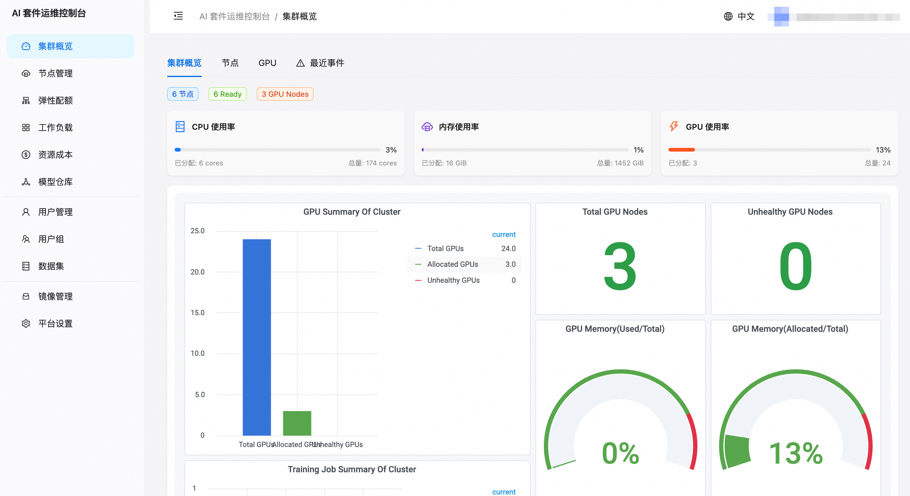
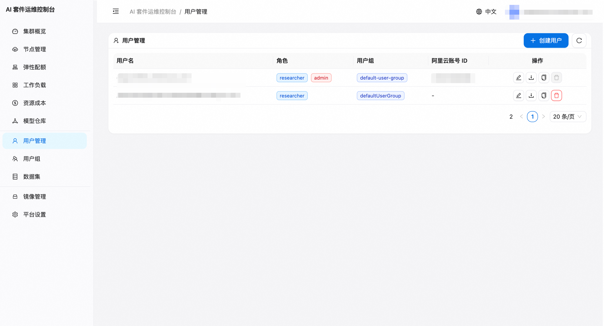
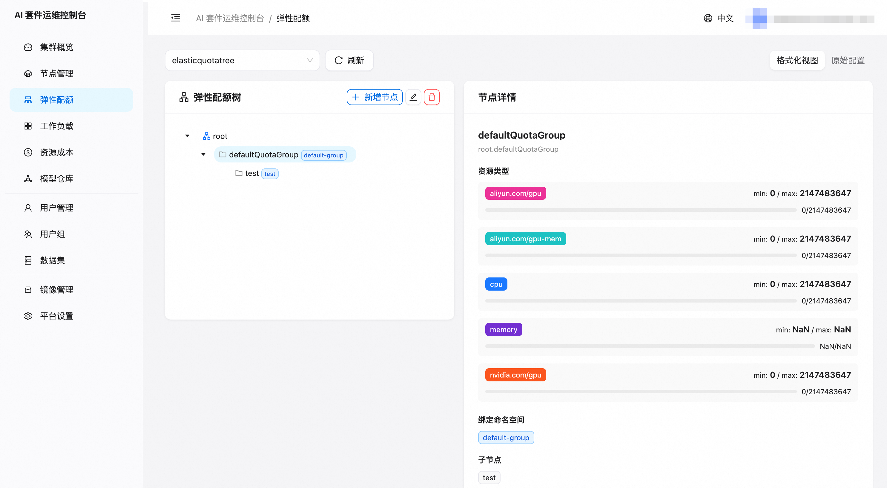
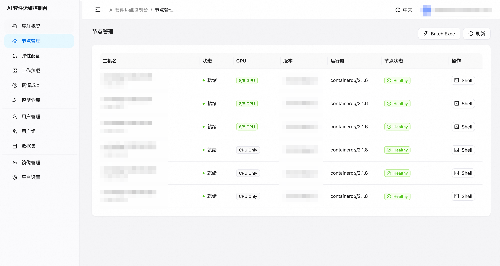
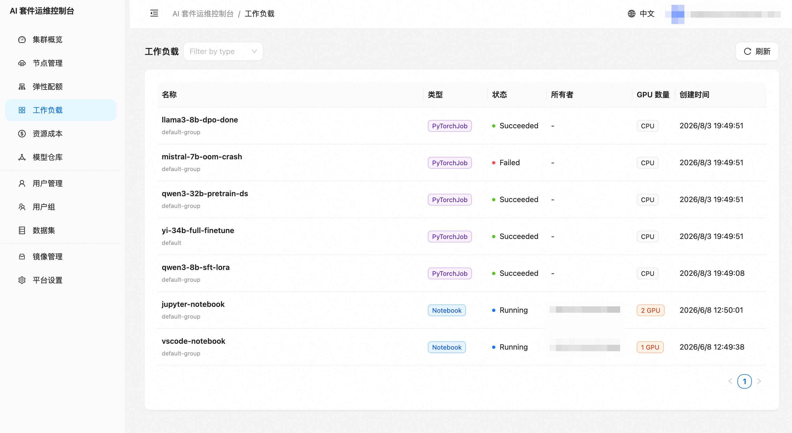
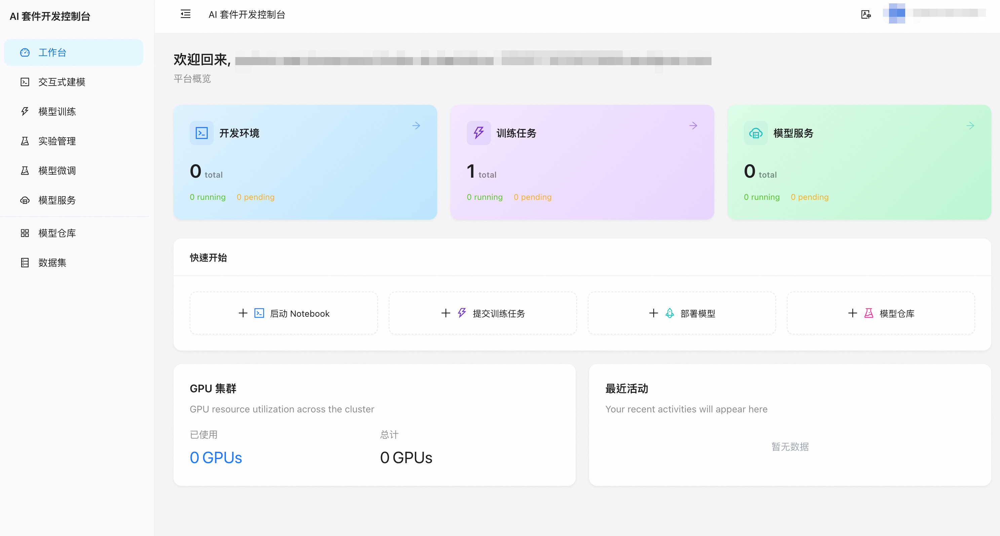
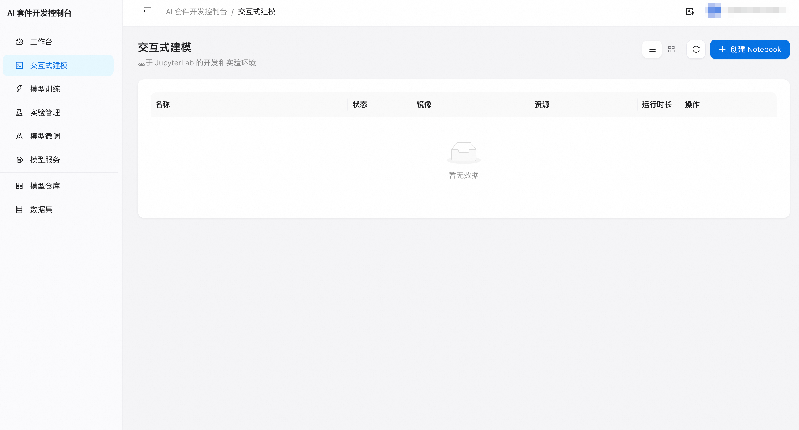
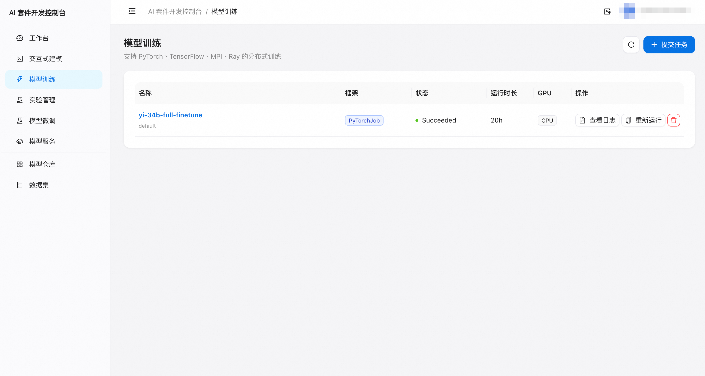
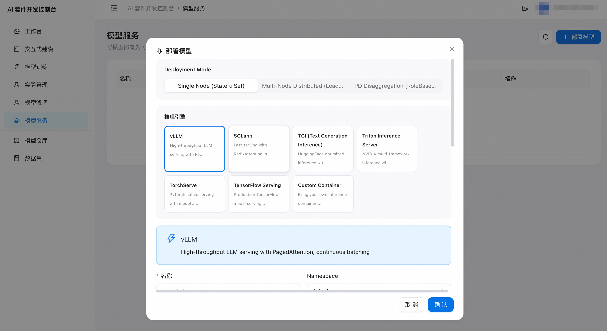

# 功能使用指南

本文介绍 data-on-ack AI 平台的核心功能和使用方法。

## 运维控制台（ai-dashboard）

运维控制台面向**集群管理员**，提供用户管理、资源配额、集群监控等运维能力。

### 用户管理

1. 登录运维控制台，进入 **用户管理** 页面
2. 点击 **创建用户**，填写 RAM 子账号的 UID 或 UPN
3. 为用户分配 **用户组**（决定可使用的 namespace 和资源配额）
4. 用户使用 RAM 子账号登录开发控制台即可看到分配的资源

### 用户组与配额管理

1. 进入 **用户组** 页面
2. 创建用户组，关联 **ElasticQuotaTree** 叶子节点
3. 叶子节点的 namespace 即为该组用户可使用的命名空间
4. 配额由 ACK 的弹性配额调度器自动执行

### 节点管理

管理员可在节点管理页面查看集群节点状态、GPU 资源分布：

### 工作负载

查看集群中运行的所有 AI 工作负载（训练任务、Notebook、推理服务）：

### Node Shell

管理员可以通过 **运维** > **Node Shell** 在节点上执行命令，用于：
- 检查 GPU 驱动状态 (`nvidia-smi`)
- 排查节点网络问题
- 查看节点磁盘使用

> **安全说明**：Node Shell 功能仅限 admin 角色使用，普通用户调用返回 403。

---

## 开发控制台（ai-dev-console）

开发控制台面向 **ML 工程师/研究员**，提供模型开发全流程工具。

### Notebook 管理

#### 创建 Notebook

1. 进入 **Notebooks** 页面，点击 **创建**
2. 选择类型：
   - **Jupyter Lab**：标准 Jupyter 环境
   - **VS Code Server**：浏览器内 VS Code
3. 配置资源：CPU/Memory/GPU
4. 选择镜像（支持自定义镜像）
5. 挂载数据集 PVC（可选）
6. 点击创建，等待 Pod Running

#### 访问 Notebook

Notebook 启动后，点击 **打开** 按钮直接在浏览器中打开 Jupyter/VSCode 界面。

访问路径（代理）：
- Jupyter: `https://<domain>/notebook/<namespace>/<name>/lab`
- VSCode: `https://<domain>/vscode/<namespace>/<name>/`

#### 生命周期管理

- **停止**：释放 GPU 资源，保留 PVC 数据
- **启动**：恢复之前停止的 Notebook
- **删除**：彻底删除（PVC 数据保留）
- **Resize**：调整 CPU/Memory/GPU 配额

### 训练任务

#### 提交训练任务

1. 进入 **训练任务** 页面，点击 **创建**
2. 选择框架：PyTorch / TensorFlow / XGBoost
3. 配置：
   - Worker 数量和资源
   - 训练镜像和启动命令
   - 数据集挂载
   - 弹性配额组
4. 提交任务

#### 查看任务状态

- **任务列表**：查看所有任务的运行状态
- **任务详情**：
  - Pod 状态和事件
  - 实时日志（支持多 Worker 切换）
  - Checkpoint 列表
  - YAML 定义

### 模型推理

#### 部署推理服务

1. 进入 **推理服务** 页面，点击 **部署**
2. 配置：
   - 模型路径（PVC 或 OSS）
   - 推理框架（Triton / vLLM / TGI）
   - 副本数和资源
3. 部署后获得 ClusterIP 或 Ingress 端点

#### 测试推理

部署完成后，可在详情页 **测试** 标签发送请求验证推理服务。

### 实验管理

实验功能用于跟踪和对比多次训练的超参数和指标：

1. 创建实验
2. 提交训练任务时关联实验
3. 在实验详情页查看所有关联的 Run 及其指标对比

### 数据集管理

1. 进入 **数据集** 页面
2. 创建 PVC 数据集：
   - 选择 StorageClass（云盘 / NAS / OSS）
   - 指定容量
3. 创建后可在 Notebook / 训练任务中挂载使用

---

## 访问方式

| 角色 | 控制台 | 登录方式 |
|------|--------|----------|
| 集群管理员 | 运维控制台 | 阿里云主账号 RAM SSO |
| ML 工程师 | 开发控制台 | 阿里云 RAM 子账号 SSO |
| 运维人员 | 运维控制台 | 阿里云主账号 / admin 子账号 |

## 权限模型

| 角色 | 能力 |
|------|------|
| admin | 所有 namespace 操作、Node Shell、用户管理 |
| researcher | 仅限分配的 namespace 内操作 Notebook/训练/推理 |
