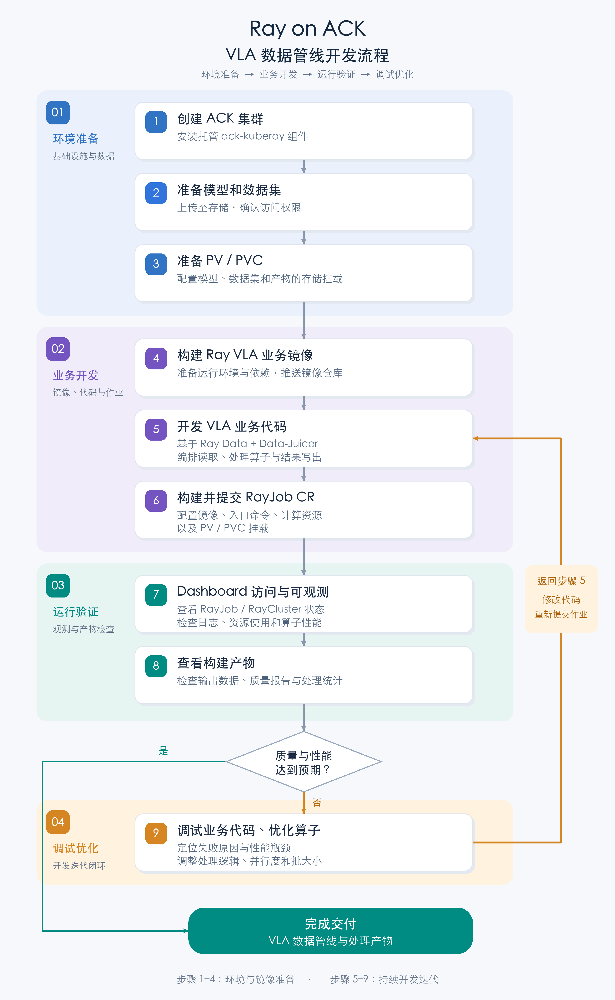
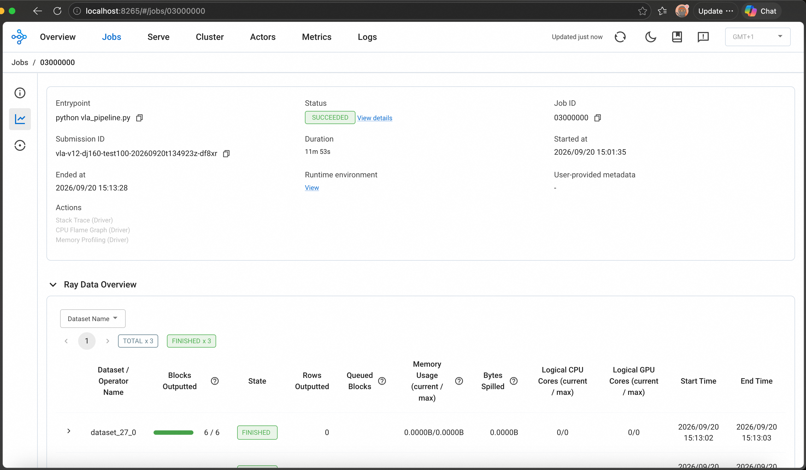
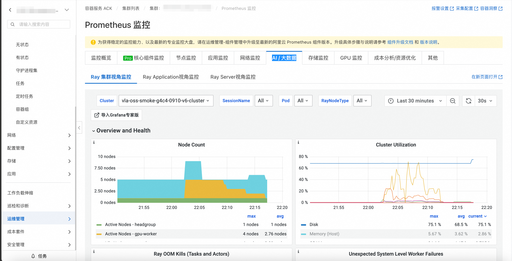

# VLA管线Demo

# 简介

机器人在物理环境中实现自主操作，不仅依赖环境感知能力，还需要形成涵盖任务目标理解、环境状态预测与动作执行的完整闭环。相较于数字空间，真实环境具有更强的不确定性。遮挡、光照变化、物体形变以及相机运动等因素，均可能导致相同操作呈现不同的观测结果与状态变化。视觉—语言—动作模型（Vision-Language-Action，VLA）旨在解决此类问题，其训练通常需要以动作片段为单位组织的视频数据，并结合三维手部状态、相机运动轨迹及自然语言指令等信号。

训练数据获取是制约 VLA 模型规模化发展的关键瓶颈。真实机器人数据采集能够提供较高精度的状态与动作信息，但其规模受到硬件成本、实验场地、安全要求及人工标注开销的显著限制。互联网视频具有较大的数据规模和丰富的场景覆盖范围，但通常缺乏精确的三维状态、相机运动信息及结构化动作表征。第一视角人类视频（Egocentric Human Videos）为解决上述矛盾提供了一种可行的数据来源。此类视频可通过可穿戴设备进行规模化采集，其观察视角与机器人的第一视角感知具有较高一致性，并能够自然记录操作者的双手运动及其与环境物体的交互过程。通过从视频中恢复相机位姿、场景深度、双手三维姿态及动作语义信息，可进一步构建完整的观测—动作轨迹，为 VLA 模型的预训练与下游任务适配提供结构化数据基础。

VITRA 是一种机器人操作视觉—语言—动作（VLA）模型预训练方法，使用大量未经脚本设计的真实生活人类手部活动视频。VITRA 将人手视为机器人末端执行器，并证明：无需任何人工标注，即可将“自然场景中”的第一视角人类视频转换为与现有机器人 VLA 训练数据在任务粒度和标签形式上完全对齐的数据格式。本文参考 VITRA 论文的技术路线，将其中的核心环节封装为RayData map\_batches，在阿里云 ACK 的 Ray 环境中，将第一视角人类视频转化为 LeRobotDataset v2.0 格式的训练数据。整条链路使用 CPU 完成视频裁切和动作分割，在 GPU 上通过 Ray GPU Actor 加载 HaWoR、MoGe-2 和 MegaSAM 模型完成三维重建，最终输出符合 LeRobot v2.0 格式的标准化 VLA 训练数据集。

# 整体流程

接下来将逐步分解如何通过 Ray on ACK 方案跑具身智能场景 VLA 数据管线：

1.  ACK 集群创建+托管ack-kuberay 组件安装

2.  模型和数据集准备

3.  ACK 集群 PV/PVC 准备

4.  Ray VLA 业务镜像构建

5.  基于 Ray Data + data juicer 的VLA 业务代码

6.  构建并提交 RayJob CR

7.  RayJob /RayCluster dashboard 访问/可观测

8.  构建产物查看

9.  业务代码调试 算子优化，重新走 5 流程




# 操作步骤

## ACK 集群创建 + 托管 ack-kuberay 组件安装

### 创建ACK集群

#### 方式一：通过控制台创建

按照[首次使用 ACK 快速入门](https://help.aliyun.com/zh/ack/ack-managed-and-ack-dedicated/getting-started/quick-start-for-first-time-users)创建 ACK 托管版集群。生产环境建议选择 Pro 版，并提前规划地域、VPC、vSwitch、Service CIDR 和 Terway Pod vSwitch。

#### 方式二：通过阿里云 CLI 创建

使用前参考附录完成阿里云 CLI 配置。

集群创建会产生 ACK、ECS、SLB、NAT 网关等资源费用。执行前请确认资源规格、网络规划、配额和账户余额。下面的模板创建 ACK 托管版 Pro 集群和一个 GPU 节点池；请先替换所有 `<...>` 占位符，并根据目标地域可用规格调整节点配置。

创建 `create-ack.json`：

```json
{
  "name": "vla-ray-cluster",
  "cluster_type": "ManagedKubernetes",
  "profile": "Default",
  "cluster_spec": "ack.pro.small",
  "region_id": "<region-id>",
  "snat_entry": true,
  "endpoint_public_access": false,
  "deletion_protection": true,
  "proxy_mode": "ipvs",
  "timezone": "Asia/Shanghai",
  "addons": [
    {
      "name": "terway-controlplane",
      "config": "{\"ENITrunking\":\"true\"}"
    },
    {
      "name": "terway-eniip",
      "config": "{\"IPVlan\":\"false\",\"NetworkPolicy\":\"false\",\"ENITrunking\":\"true\"}"
    },
    { "name": "csi-plugin" },
    { "name": "managed-csiprovisioner" }
  ],
  "os_type": "Linux",
  "platform": "AliyunLinux",
  "image_type": "AliyunLinux3",
  "pod_vswitch_ids": ["<pod-vswitch-id>"],
  "charge_type": "PostPaid",
  "vpcid": "<vpc-id>",
  "service_cidr": "172.21.0.0/20",
  "vswitch_ids": ["<vswitch-id>"],
  "ip_stack": "ipv4",
  "nodepools": [
    {
      "nodepool_info": {
        "name": "gpu-worker"
      },
      "scaling_group": {
        "system_disk_category": "cloud_essd",
        "system_disk_size": 120,
        "system_disk_performance_level": "PL0",
        "vswitch_ids": ["<vswitch-id>"],
        "instance_types": ["<gpu-instance-type>"],
        "instance_charge_type": "PostPaid",
        "platform": "AliyunLinux",
        "image_type": "AliyunLinux3",
        "desired_size": 1
      },
      "kubernetes_config": {
        "cpu_policy": "none",
        "cms_enabled": true,
        "unschedulable": false,
        "runtime": "containerd",
        "runtime_version": "1.6.36"
      }
    }
  ]
}
```

提交创建请求并记录集群 ID：

```bash
export REGION_ID="<region-id>"

CREATE_RESULT="$(
  aliyun cs POST /clusters \
    --region "${REGION_ID}" \
    --header "Content-Type=application/json" \
    --body "$(cat create-ack.json)"
)"
printf '%s\n' "${CREATE_RESULT}" | jq .
export CLUSTER_ID="$(printf '%s' "${CREATE_RESULT}" | jq -r '.cluster_id')"

# 创建操作为异步执行；重复查询，直至 state 进入 running
aliyun cs GET "/clusters/${CLUSTER_ID}" --region "${REGION_ID}" | jq .
```

模板默认关闭 API Server 公网访问，应在 VPC 内或通过 CloudShell 管理集群。如果确实需要从公网连接，可将 `endpoint_public_access` 改为 `true`，并按最小范围限制访问来源。完整字段和有效取值以 [CreateCluster API](https://help.aliyun.com/zh/ack/ack-managed-and-ack-dedicated/developer-reference/create-a-cluster-2) 为准。

### 安装集群组件 Kuberay-Operator

按照 [Ray on ACK 最佳实践](https://help.aliyun.com/zh/ack/cloud-native-ai-suite/use-cases/ray-cluster-best-practices/)在 ACK 控制台的组件管理页面安装托管版 Kuberay-Operator。该托管组件由 ACK 负责版本维护，并集成调度、弹性配额、Prometheus、SLS 和 OSS 等能力，因此本文不使用 Helm 安装开源版本替代它。

### 获取集群 KubeConfig 并通过 kubectl 连接集群

#### 方式一：通过控制台获取

按照[获取集群 KubeConfig 并使用 kubectl 连接集群](https://help.aliyun.com/zh/ack/ack-managed-and-ack-dedicated/user-guide/obtain-the-kubeconfig-file-of-a-cluster-and-use-kubectl-to-connect-to-the-cluster)下载公网或内网 KubeConfig。

#### 方式二：通过阿里云 CLI 获取

复用创建集群时得到的 `REGION_ID` 和 `CLUSTER_ID`。KubeConfig 包含集群访问凭据，不得提交到 Git 仓库或通过不安全渠道传递。

```bash
export KUBECONFIG="${HOME}/.kube/vla-ray-cluster.config"
mkdir -p "$(dirname "${KUBECONFIG}")"

aliyun cs GET "/k8s/${CLUSTER_ID}/user_config" \
  --region "${REGION_ID}" \
  | jq -r '.config' > "${KUBECONFIG}"
chmod 600 "${KUBECONFIG}"

kubectl cluster-info
kubectl get nodes
```

请选择与执行环境网络连通的 KubeConfig：VPC 内使用内网连接，本地工作站需要集群已启用并安全配置 API Server 公网访问。

## 模型和数据集准备

### 数据： 

**EgoDex** Test Set (16 GB)

[https://github.com/apple-aiml-research/ml-egodex](https://github.com/apple-aiml-research/ml-egodex)

下载并解压后，将数据上传至OSS  对应Bucket 根目录下 /egodex/data/test/ 

### 模型：

| mano/MANO\_LEFT.pkl | 4 MB | [MANO 官网](https://mano.is.tue.mpg.de/)（需注册，下载 `mano_v*_*.zip`后解压） |
| --- | --- | --- |
| mano/MANO\_RIGHT.pkl | 4 MB | [MANO 官网](https://mano.is.tue.mpg.de/)（需注册，下载 `mano_v*_*.zip`后解压） |
| hawor/hawor.ckpt | 3.1 GB | [HuggingFace ThunderVVV/HaWoR](https://huggingface.co/ThunderVVV/HaWoR/resolve/main/hawor/checkpoints/hawor.ckpt) |
| hawor/model\_config.yaml | 3 KB | [HuggingFace ThunderVVV/HaWoR](https://huggingface.co/ThunderVVV/HaWoR/resolve/main/hawor/model_config.yaml) |
| hawor/detector.pt | 51 MB | [HuggingFace rolpotamias/WiLoR](https://huggingface.co/spaces/rolpotamias/WiLoR/resolve/main/pretrained_models/detector.pt) |
| moge/model.pt | 1.3 GB | [HuggingFace Ruicheng/moge-2-vitl-normal](https://huggingface.co/Ruicheng/moge-2-vitl-normal) |

模型文件上传至OSS 对应Bucket 根目录下/models/

### 数据上传 OSS 方式

#### 方式一：通过控制台上传

先在本地解压 ZIP，然后：

1. 进入 OSS 控制台 → Bucket 列表 → 目标 Bucket → 文件列表。
2. 单击“上传文件”。
3. 将解压后的整个文件夹拖入上传区域。
4. 确认目标目录后上传。控制台会保留文件夹结构，单个文件不能超过 5 GB。

更多信息，请参见 [OSS 简单上传](https://help.aliyun.com/zh/oss/user-guide/simple-upload)。

#### 方式二：通过阿里云 CLI 上传

阿里云 CLI v3.0.304 及以上版本集成了 ossutil 2.0，可通过 `aliyun ossutil` 管理 Bucket 和 Object。下面使用公网 Endpoint 从本地上传；后续 ACK PV 挂载仍建议使用同地域内网 Endpoint。

Bucket 名称在全球范围内唯一，请替换为你自己的名称。输入 Bucket 存放数据、模型和代码，输出 Bucket 存放作业结果；如 Bucket 已存在，可跳过对应的 `mb` 命令。

```bash
export REGION_ID="<region-id>"
export OSS_PUBLIC_ENDPOINT="https://oss-${REGION_ID}.aliyuncs.com"
export OSS_ROOT_BUCKET="<input-and-model-bucket>"
export OSS_OUTPUT_BUCKET="<output-bucket>"

# 确认集成的 ossutil 可用
aliyun ossutil version

# 创建私有 Bucket
aliyun ossutil mb "oss://${OSS_ROOT_BUCKET}" \
  --region "${REGION_ID}" \
  --endpoint "${OSS_PUBLIC_ENDPOINT}"
aliyun ossutil mb "oss://${OSS_OUTPUT_BUCKET}" \
  --region "${REGION_ID}" \
  --endpoint "${OSS_PUBLIC_ENDPOINT}"

# 上传 EgoDex 数据，目标目录为 /egodex/data/test/
aliyun ossutil cp ./egodex/data/test/ \
  "oss://${OSS_ROOT_BUCKET}/egodex/data/test/" \
  --recursive --update \
  --region "${REGION_ID}" \
  --endpoint "${OSS_PUBLIC_ENDPOINT}"

# 上传模型，目标目录为 /models/
aliyun ossutil cp ./models/ \
  "oss://${OSS_ROOT_BUCKET}/models/" \
  --recursive --update \
  --region "${REGION_ID}" \
  --endpoint "${OSS_PUBLIC_ENDPOINT}"

# 验证上传结果
aliyun ossutil ls "oss://${OSS_ROOT_BUCKET}/egodex/data/test/" \
  --recursive --region "${REGION_ID}" --endpoint "${OSS_PUBLIC_ENDPOINT}"
aliyun ossutil ls "oss://${OSS_ROOT_BUCKET}/models/" \
  --recursive --region "${REGION_ID}" --endpoint "${OSS_PUBLIC_ENDPOINT}"
```

`--update` 使重复执行时只上传源文件中较新的内容。不要在命令行中显式传入 `--access-key-id` 或 `--access-key-secret`，应复用已配置的安全身份 Profile。完整命令说明参见[使用阿里云 CLI 调用 ossutil 管理 OSS 资源](https://help.aliyun.com/zh/cli/use-alibaba-cloud-cli-to-manage-oss-data)。

## Ray VLA 镜像构建

```dockerfile
FROM pytorch/pytorch:2.7.1-cuda12.8-cudnn9-devel

LABEL description="VLA Pipeline pre-built image with Data-Juicer,  MoGe-2, HaWoR, MegaSaM, PyTorch3D support"

ENV DEBIAN_FRONTEND=noninteractive
ENV TORCH_CUDA_ARCH_LIST="7.0;7.5;8.0;8.6;8.9;9.0;12.0"
ENV FORCE_CUDA=1

# init conda for non-interactive use
RUN conda init bash
SHELL ["/bin/bash", "-c"]

RUN apt-get update && apt-get install -y --no-install-recommends \
        git \
        wget \
        vim \
        curl \
        ffmpeg \
        libgl1-mesa-glx \
        libglib2.0-0 \
        libsm6 \
        libxext6 \
        libxrender1 \
        build-essential \
        ninja-build \
    && rm -rf /var/lib/apt/lists/*

RUN pip install --no-cache-dir "py-data-juicer==1.6.0"
RUN pip install --no-cache-dir "ray[data,default]==2.56.0"
RUN pip install --no-cache-dir --force-reinstall "setuptools==69.5.1"

# 构建阶段提前确认 PyTorch 二进制已包含 Blackwell（sm_120）支持。
RUN python -c 'import torch; archs = torch._C._cuda_getArchFlags().split(); assert torch.version.cuda == "12.8", torch.version.cuda; assert "sm_120" in archs, archs'

RUN git clone --depth 1 https://github.com/ThunderVVV/HaWoR.git /root/.cache/data_juicer/assets/HaWoR

# modify requirements.txt:
#   - remove chumpy (need --no-build-isolation, install separately)
#   - remove aitviewer / moderngl-window / pyrender (OpenGL rendering, no head environment needed)
#   - relax torch-scatter version locking (install the PyTorch 2.7 / CUDA 12.8 wheel separately)
#   - relax numpy version locking (to avoid dependency resolution conflicts)
RUN cd /root/.cache/data_juicer/assets/HaWoR \
    && sed -i '/^chumpy/d' requirements.txt \
    && sed -i '/^aitviewer/d' requirements.txt \
    && sed -i '/^moderngl-window/d' requirements.txt \
    && sed -i '/^pyrender/d' requirements.txt \
    && sed -i 's/^torch-scatter==.*/# &/' requirements.txt \
    && sed -i 's/^numpy==.*/numpy/' requirements.txt

RUN pip install --no-cache-dir "torch-scatter==2.1.2" -f https://data.pyg.org/whl/torch-2.7.0+cu128.html

# MoGe-2 camera calibration
RUN pip install --no-cache-dir "moge @ git+https://github.com/microsoft/MoGe.git@925b8ed835a7a9cdb7578ba15c658a0afc969030"

# HaWoR dependencies (install from requirements.txt)
RUN pip install --no-cache-dir -r /root/.cache/data_juicer/assets/HaWoR/requirements.txt
# chumpy needs --no-build-isolation, install separately
RUN pip install --no-cache-dir --no-build-isolation "chumpy @ git+https://github.com/mattloper/chumpy"

RUN pip install --no-cache-dir scipy pyarrow av opencv-contrib-python Pillow
RUN pip install --no-cache-dir openai
RUN pip install numpy==1.26.4
RUN pip install opencv-python==4.10.0.84 opencv-contrib-python==4.10.0.84
RUN pip install --upgrade --force-reinstall click

# ===============create mega-sam conda environment================
RUN conda create -n mega-sam --clone base -y

# clone mega-sam repository and patch source code:
#   - replace .type() with .scalar_type() for newer PyTorch
#   - add L20(8.9), H20(9.0), and Blackwell(12.0) CUDA arch support
RUN git clone --recursive https://github.com/mega-sam/mega-sam.git /root/.cache/data_juicer/assets/mega-sam \
    && cd /root/.cache/data_juicer/assets/mega-sam \
    && sed -i 's/\.type()/\.scalar_type()/g' \
        base/src/altcorr_kernel.cu \
        base/src/correlation_kernels.cu \
        base/src/droid_kernels.cu \
        base/thirdparty/lietorch/lietorch/src/lietorch_gpu.cu \
        base/thirdparty/lietorch/lietorch/src/lietorch_cpu.cpp \
    && sed -i "/compute_86,code=sm_86/a\                    '-gencode=arch=compute_89,code=sm_89',\n                    '-gencode=arch=compute_90,code=sm_90',\n                    '-gencode=arch=compute_120,code=sm_120'," base/setup.py

# build droid_backends + lietorch (CUDA compile, time-consuming)
RUN cd /root/.cache/data_juicer/assets/mega-sam/base && conda run -n mega-sam python setup.py install

RUN conda run -n mega-sam pip install --force-reinstall pydantic pydantic-core typing-extensions
RUN conda run -n mega-sam pip install numpy==1.26.4
RUN conda run -n mega-sam pip install opencv-python==4.10.0.84 opencv-contrib-python==4.10.0.84
RUN conda run -n mega-sam pip install --upgrade --force-reinstall click

RUN conda clean -afy && pip cache purge 2>/dev/null || true

WORKDIR /workspace

ENTRYPOINT ["python"]

```

镜像构建完成后，推送至同地域 ACR，记录内网镜像访问地址，用于之后创建 RayJob。

### 通过阿里云 CLI 准备 ACR 并推送镜像

以下示例使用已有的 ACR 企业版实例。实例创建暂不通过 CLI 完成；如果尚无实例，请先在 ACR 控制台创建。命名空间和仓库已存在时，可跳过相应创建命令。

```bash
export ACR_INSTANCE_ID="<acr-instance-id>"
export ACR_NAMESPACE="vla"
export ACR_REPOSITORY="ray-vla-pipeline"
export ACR_REGISTRY="<registry-domain>"
export IMAGE_TAG="v1"

# 查询实例，并创建私有命名空间和仓库
aliyun cr ListInstance
aliyun cr CreateNamespace \
  --InstanceId "${ACR_INSTANCE_ID}" \
  --NamespaceName "${ACR_NAMESPACE}" \
  --AutoCreateRepo false
aliyun cr CreateRepository \
  --InstanceId "${ACR_INSTANCE_ID}" \
  --RepoNamespaceName "${ACR_NAMESPACE}" \
  --RepoName "${ACR_REPOSITORY}" \
  --RepoType PRIVATE \
  --Summary "Ray VLA pipeline image"

# 获取临时登录凭证，并通过标准输入交给 Docker，避免密码进入命令历史
TOKEN_JSON="$(aliyun cr GetAuthorizationToken --InstanceId "${ACR_INSTANCE_ID}")"
printf '%s' "$(printf '%s' "${TOKEN_JSON}" | jq -r '.data.authorizationToken')" \
  | docker login "${ACR_REGISTRY}" \
      --username "$(printf '%s' "${TOKEN_JSON}" | jq -r '.data.tempUserName')" \
      --password-stdin

export RAY_IMAGE="${ACR_REGISTRY}/${ACR_NAMESPACE}/${ACR_REPOSITORY}:${IMAGE_TAG}"
docker build -t "${RAY_IMAGE}" .
docker push "${RAY_IMAGE}"
```

`GetAuthorizationToken` 返回的是短期凭证，只用于本次镜像推送。后续创建长期有效的 Kubernetes `imagePullSecret` 时，请使用 ACR 实例访问凭证或具备最小只读权限的专用 RAM 身份，不要把临时 Token 或个人凭证提交到仓库。ACK 集群拉取镜像时，`RAY_IMAGE` 应优先改为同地域的 ACR VPC 地址。

## ACK 集群PV/PVC/Secret 准备

按实际情况调整init.sh中的环境变量，创建init.sh,fixed-resources.yaml.tpl

```shell
# Kubernetes 命名空间
export NAMESPACE="default"

# RayJob 资源名称
export RAY_JOB_NAME="vla-ray-job"

# Ray 版本，应与容器镜像中的 Ray 版本一致
export RAY_VERSION="2.56.0"

# Ray Head 和 Worker 使用的容器镜像
export RAY_IMAGE="<registry>/<repository>:<tag>"


# Kubernetes 镜像拉取凭据 Secret 名称
export IMAGE_PULL_SECRET_NAME="ray-image-pull-secret"

# 镜像仓库地址，例如 registry-vpc.cn-hangzhou.aliyuncs.com
export REGISTRY_SERVER="<registry-server>"

# 镜像仓库登录用户名
export REGISTRY_USERNAME="<registry-username>"

# 镜像仓库登录密码
export REGISTRY_PASSWORD="<registry-password>"


# 保存 OpenAI 配置的 Kubernetes Secret 名称
export OPENAI_SECRET_NAME="ray-openai-secret"

# OpenAI API 密钥，填写原始值，脚本会自动进行 Base64 编码
export OPENAI_API_KEY="<openai-api-key>"

# OpenAI 兼容接口地址，填写原始值，脚本会自动进行 Base64 编码
export OPENAI_BASE_URL="<openai-base-url>"


# 保存 OSS AccessKey 的 Kubernetes Secret 名称
export OSS_SECRET_NAME="ray-oss-secret"

# OSS AccessKey ID
export OSS_ACCESS_KEY_ID="<oss-access-key-id>"

# OSS AccessKey Secret
export OSS_ACCESS_KEY_SECRET="<oss-access-key-secret>"

# OSS Endpoint，建议使用与集群同地域的内网地址
export OSS_ENDPOINT="<oss-endpoint>"

# OSS 请求签名版本；使用 V4 时需确保客户端支持
export OSS_SIG_VERSION="v4"


# 输入数据、模型和代码存储对应的 PV 名称
export OSS_ROOT_PV_NAME="ray-vla-root-pv"

# 输入数据、模型和代码存储对应的 PVC 名称
export OSS_ROOT_PVC_NAME="ray-vla-root-pvc"

# 存放输入数据、模型和代码的 OSS Bucket
export OSS_ROOT_BUCKET="<input-and-model-bucket>"

# Bucket 内作为挂载根目录的前缀
export OSS_ROOT_PATH="/<input-and-model-prefix>"


# 输出数据存储对应的 PV 名称
export OSS_OUTPUT_PV_NAME="ray-vla-output-pv"

# 输出数据存储对应的 PVC 名称
export OSS_OUTPUT_PVC_NAME="ray-vla-output-pvc"

# 存放作业输出结果的 OSS Bucket
export OSS_OUTPUT_BUCKET="<output-bucket>"

# Bucket 内用于保存作业输出的前缀
export OSS_OUTPUT_PATH="/<output-prefix>"


required_vars=(
  NAMESPACE RAY_JOB_NAME RAY_VERSION RAY_IMAGE
  IMAGE_PULL_SECRET_NAME REGISTRY_SERVER REGISTRY_USERNAME REGISTRY_PASSWORD
  OPENAI_SECRET_NAME OPENAI_API_KEY OPENAI_BASE_URL
  OSS_SECRET_NAME OSS_ACCESS_KEY_ID OSS_ACCESS_KEY_SECRET OSS_ENDPOINT OSS_SIG_VERSION
  OSS_ROOT_PV_NAME OSS_ROOT_PVC_NAME OSS_ROOT_BUCKET OSS_ROOT_PATH
  OSS_OUTPUT_PV_NAME OSS_OUTPUT_PVC_NAME OSS_OUTPUT_BUCKET OSS_OUTPUT_PATH
)

for var_name in "${required_vars[@]}"; do
  var_value="${!var_name:-}"
  if [[ -z "${var_value}" || "${var_value}" == *"<"* || "${var_value}" == *">"* ]]; then
    echo "变量 ${var_name} 未设置或仍包含示例占位符" >&2
    exit 1
  fi
done

export OSS_ACCESS_KEY_ID_BASE64="$(printf '%s' "${OSS_ACCESS_KEY_ID}" | base64 | tr -d '\n')"
export OSS_ACCESS_KEY_SECRET_BASE64="$(printf '%s' "${OSS_ACCESS_KEY_SECRET}" | base64 | tr -d '\n')"
export OPENAI_API_KEY_BASE64="$(printf '%s' "${OPENAI_API_KEY}" | base64 | tr -d '\n')"
export OPENAI_BASE_URL_BASE64="$(printf '%s' "${OPENAI_BASE_URL}" | base64 | tr -d '\n')"
REGISTRY_AUTH_BASE64="$(
  printf '%s' "${REGISTRY_USERNAME}:${REGISTRY_PASSWORD}" \
    | base64 \
    | tr -d '\r\n'
)"

export DOCKER_CONFIG_JSON_BASE64="$(
  printf '{"auths":{"%s":{"auth":"%s"}}}' \
    "${REGISTRY_SERVER}" \
    "${REGISTRY_AUTH_BASE64}" \
    | base64 \
    | tr -d '\r\n'
)"
```
```python
apiVersion: v1
kind: Secret
metadata:
  name: "${IMAGE_PULL_SECRET_NAME}"
  namespace: "${NAMESPACE}"
type: kubernetes.io/dockerconfigjson
data:
  .dockerconfigjson: "${DOCKER_CONFIG_JSON_BASE64}"
---
apiVersion: v1
kind: Secret
metadata:
  name: "${OSS_SECRET_NAME}"
  namespace: "${NAMESPACE}"
type: Opaque
data:
  akId: "${OSS_ACCESS_KEY_ID_BASE64}"
  akSecret: "${OSS_ACCESS_KEY_SECRET_BASE64}"
---
apiVersion: v1
kind: Secret
metadata:
  name: "${OPENAI_SECRET_NAME}"
  namespace: "${NAMESPACE}"
type: Opaque
data:
  OPENAI_API_KEY: "${OPENAI_API_KEY_BASE64}"
  OPENAI_BASE_URL: "${OPENAI_BASE_URL_BASE64}"
---
apiVersion: v1
kind: PersistentVolume
metadata:
  name: "${OSS_ROOT_PV_NAME}"
spec:
  capacity:
    storage: 100Gi
  accessModes:
    - ReadOnlyMany
  persistentVolumeReclaimPolicy: Retain
  storageClassName: ""
  volumeMode: Filesystem
  csi:
    driver: ossplugin.csi.alibabacloud.com
    volumeHandle: "${OSS_ROOT_PV_NAME}"
    nodePublishSecretRef:
      name: "${OSS_SECRET_NAME}"
      namespace: "${NAMESPACE}"
    volumeAttributes:
      bucket: "${OSS_ROOT_BUCKET}"
      path: "${OSS_ROOT_PATH}"
      url: "${OSS_ENDPOINT}"
      sigVersion: "${OSS_SIG_VERSION}"
      otherOpts: "${OSS_ROOT_OTHER_OPTS}"
---
apiVersion: v1
kind: PersistentVolumeClaim
metadata:
  name: "${OSS_ROOT_PVC_NAME}"
  namespace: "${NAMESPACE}"
spec:
  accessModes:
    - ReadOnlyMany
  resources:
    requests:
      storage: 100Gi
  storageClassName: ""
  volumeMode: Filesystem
  volumeName: "${OSS_ROOT_PV_NAME}"
---
apiVersion: v1
kind: PersistentVolume
metadata:
  name: "${OSS_OUTPUT_PV_NAME}"
spec:
  capacity:
    storage: 500Gi
  accessModes:
    - ReadWriteMany
  persistentVolumeReclaimPolicy: Retain
  storageClassName: ""
  volumeMode: Filesystem
  csi:
    driver: ossplugin.csi.alibabacloud.com
    volumeHandle: "${OSS_OUTPUT_PV_NAME}"
    nodePublishSecretRef:
      name: "${OSS_SECRET_NAME}"
      namespace: "${NAMESPACE}"
    volumeAttributes:
      bucket: "${OSS_OUTPUT_BUCKET}"
      path: "${OSS_OUTPUT_PATH}"
      url: "${OSS_ENDPOINT}"
      sigVersion: "${OSS_SIG_VERSION}"
      otherOpts: "${OSS_OUTPUT_OTHER_OPTS}"
---
apiVersion: v1
kind: PersistentVolumeClaim
metadata:
  name: "${OSS_OUTPUT_PVC_NAME}"
  namespace: "${NAMESPACE}"
spec:
  accessModes:
    - ReadWriteMany
  resources:
    requests:
      storage: 500Gi
  storageClassName: ""
  volumeMode: Filesystem
  volumeName: "${OSS_OUTPUT_PV_NAME}"

```

在可访问ACK集群的唤醒下执行以下代码

```powershell
source init.sh
envsubst < fixed-resources.yaml.tpl > fixed-resources.yaml
kubectl apply -f fixed-resources.yaml
```

## 基于 Ray Data + data juicer 的VLA 业务代码

将 vla\_pipeline.py  video\_action\_captioning\_mapper.py 上传到OSS code 目录下，上传方式参考3.2.3

```python
#!/usr/bin/env python3
"""
数据源、输出目录、模型路径或资源参数，可按需调整
"""

from __future__ import annotations

import json
import os
import sys
import time
from dataclasses import dataclass
from pathlib import Path
from typing import Any

# 1. 输入数据：所有 Ray Pod 都能访问的 MP4 根目录，代码会递归查找 *.mp4。
INPUT_DIR = "/data/oss/egodex/data/test"

# 2. 输出根目录：所有 Ray Pod 都能写入的 OSS RWX 路径。
OUTPUT_ROOT = (
    "/data/output/vla-results/"
    "vla-demo"
)

# 3. 模型根目录，目录结构见 validate_models()。
MODEL_ROOT = "/data/oss/models"

# 4. 数据与导出参数。 Demo 固定处理排序后的前 100 个 MP4。
LIMIT = 100
TASK_TEXT = "manipulate object"
FRAME_NUM = 20
LEROBOT_FPS = 10

# 5. Ray Data 资源参数。MoGe 固定 8 个 Actor；Combined 可从 8 扩到 14；
#    每个 Actor 申请 0.25 GPU，GPU_BATCH_SIZE 只作用于这两个阶段。
CPU_PER_TASK = 1.0
GPU_BATCH_SIZE = 16
MOGE_GPUS = 0.25
COMBINED_GPUS = 0.25
MOGE_ACTOR_MIN = 8
MOGE_ACTOR_MAX = 8
COMBINED_ACTOR_MIN = 8
COMBINED_ACTOR_MAX = 14

# 6. 字幕模型。OPENAI_API_KEY 应预先注入 Ray Head，或通过 Ray Job runtime_env
#    传入；不要把密钥直接写进本文件。缺少凭据时当前 Mapper 会告警并回退文本。
CAPTION_MODEL = os.environ.get("VLA_CAPTION_MODEL", "qwen-vl-max")
CAPTION_API_ENDPOINT = os.environ.get("VLA_CAPTION_API_ENDPOINT", "")

VIDEO_KEY = "videos"
EXPECTED_DATA_JUICER_VERSION = "1.6.0"

import ray  # noqa: E402
from ray.data import ActorPoolStrategy  # noqa: E402

from data_juicer.ops.base_op import OPERATORS, Mapper  # noqa: E402
from data_juicer.ops.mapper import (  # noqa: E402
    ExportToLeRobotMapper,
    VideoCameraCalibrationMogeMapper,
    VideoCameraPoseMegaSaMMapper,
    VideoExtractFramesMapper,
    VideoHandActionComputeMapper,
    VideoHandReconstructionHaworMapper,
)
from data_juicer.utils.constant import Fields, MetaKeys  # noqa: E402

sys.path.insert(0, os.path.dirname(__file__))
from video_action_captioning_mapper import VideoActionCaptioningMapper  # noqa: E402


@OPERATORS.register_module("video_hawor_megasam_combined_mapper")
class VideoHaWorMegaSaMCombinedMapper(Mapper):
    """在同一个 GPU Actor 内依次执行 HaWoR 和 MegaSaM。"""

    _accelerator = "cuda"

    def __init__(
            self,
            hawor_model_path: str,
            hawor_config_path: str,
            hawor_detector_path: str,
            mano_right_path: str,
            mano_left_path: str,
            camera_calibration_field: str = MetaKeys.camera_calibration_moge_tags,
            hawor_tag_field: str = MetaKeys.hand_reconstruction_hawor_tags,
            frame_field: str = MetaKeys.video_frames,
            megasam_tag_field: str = MetaKeys.video_camera_pose_tags,
            megasam_save_dir: str | None = None,
            *args: Any,
            **kwargs: Any,
    ) -> None:
        super().__init__(*args, **kwargs)
        common = {
            "batch_mode": True,
            "skip_op_error": kwargs.get("skip_op_error", False),
        }
        self._hawor_kwargs = {
            "hawor_model_path": hawor_model_path,
            "hawor_config_path": hawor_config_path,
            "hawor_detector_path": hawor_detector_path,
            "mano_right_path": mano_right_path,
            "mano_left_path": mano_left_path,
            "camera_calibration_field": camera_calibration_field,
            "tag_field_name": hawor_tag_field,
            "frame_field": frame_field,
            "thresh": 0.2,
            **common,
        }
        self._megasam_kwargs = {
            "tag_field_name": megasam_tag_field,
            "camera_calibration_field": camera_calibration_field,
            "frame_field": frame_field,
            "max_frames": 1000,
            "droid_buffer": 1024,
            "save_dir": megasam_save_dir,
            **common,
        }
        self._hawor_op: VideoHandReconstructionHaworMapper | None = None
        self._megasam_op: VideoCameraPoseMegaSaMMapper | None = None

    def process_single(
            self,
            sample: dict[str, Any] | None = None,
            rank: int | None = None,
    ) -> dict[str, Any]:
        from loguru import logger

        if sample is None:
            raise ValueError("sample must not be None")
        if self._hawor_op is None:
            self._hawor_op = VideoHandReconstructionHaworMapper(
                **self._hawor_kwargs
            )
        if self._megasam_op is None:
            self._megasam_op = VideoCameraPoseMegaSaMMapper(
                **self._megasam_kwargs
            )

        sample = self._hawor_op.process_single(sample, rank=rank)
        try:
            return self._megasam_op.process_single(sample, rank=rank)
        except Exception as error:
            # 与 V11 一致：MegaSaM 失败时保留 HaWoR 结果，让后续阶段继续。
            logger.exception(f"MegaSaM failed; HaWoR result is preserved: {error}")
            sample.setdefault(Fields.meta, {})
            frame_field = self._hawor_kwargs["frame_field"]
            tag_field = self._megasam_kwargs["tag_field_name"]
            sample[Fields.meta][tag_field] = [
                {} for _ in range(max(1, len(sample.get(frame_field, []))))
            ]
            return sample


@dataclass(frozen=True)
class Paths:
    root: Path
    frames: Path
    moge_arrays: Path
    megasam_arrays: Path
    lerobot: Path
    processed_json: Path
    processed_parquet: Path


@dataclass(frozen=True)
class Models:
    moge: Path
    hawor: Path
    hawor_config: Path
    hawor_detector: Path
    mano_right: Path
    mano_left: Path


def validate_models(root: Path) -> Models:
    """要求 MODEL_ROOT 下存在 moge/、hawor/ 和 mano/ 三个子目录。"""
    models = Models(
        moge=root / "moge/model.pt",
        hawor=root / "hawor/hawor.ckpt",
        hawor_config=root / "hawor/model_config.yaml",
        hawor_detector=root / "hawor/detector.pt",
        mano_right=root / "mano/MANO_RIGHT.pkl",
        mano_left=root / "mano/MANO_LEFT.pkl",
    )
    missing = [str(path) for path in models.__dict__.values() if not path.is_file()]
    if missing:
        raise FileNotFoundError(f"model files are missing: {missing}")
    return models


def prepare_paths() -> Paths:
    input_dir = Path(INPUT_DIR)
    output_root = Path(OUTPUT_ROOT)
    model_root = Path(MODEL_ROOT)
    for name, path in (
            ("INPUT_DIR", input_dir),
            ("OUTPUT_ROOT", output_root),
            ("MODEL_ROOT", model_root),
    ):
        if not path.is_absolute():
            raise ValueError(f"{name} must be an absolute shared-storage path")
    if not input_dir.is_dir():
        raise FileNotFoundError(f"INPUT_DIR does not exist: {input_dir}")
    if not model_root.is_dir():
        raise FileNotFoundError(f"MODEL_ROOT does not exist: {model_root}")

    run_id = time.strftime("v12-%Y%m%dT%H%M%SZ", time.gmtime())
    root = output_root / run_id
    root.mkdir(parents=True, exist_ok=False)
    return Paths(
        root=root,
        frames=root / "frames",
        moge_arrays=root / "moge_arrays",
        megasam_arrays=root / "megasam_arrays",
        lerobot=root / "lerobot_dataset",
        processed_json=root / "processed.jsonl",
        processed_parquet=root / "processed.parquet",
    )


def load_samples() -> list[dict[str, Any]]:
    videos = sorted(path for path in Path(INPUT_DIR).rglob("*.mp4") if path.is_file())
    if LIMIT > 0:
        videos = videos[:LIMIT]
    if not videos:
        raise RuntimeError(f"no MP4 files found under {INPUT_DIR}")
    return [
        {VIDEO_KEY: [str(path)], "text": TASK_TEXT, Fields.meta: {}}
        for path in videos
    ]


def run() -> None:
    import data_juicer

    if getattr(data_juicer, "__version__", "unknown") != EXPECTED_DATA_JUICER_VERSION:
        raise RuntimeError(
            f"Data-Juicer must be {EXPECTED_DATA_JUICER_VERSION}, got "
            f"{getattr(data_juicer, '__version__', 'unknown')}"
        )
    if LIMIT < 0 or FRAME_NUM < 1 or LEROBOT_FPS < 1:
        raise ValueError("LIMIT must be >= 0; FRAME_NUM and LEROBOT_FPS must be > 0")

    # 先验证模型，再创建输出目录，配置错误不会留下半成品目录。
    models = validate_models(Path(MODEL_ROOT))
    samples = load_samples()
    paths = prepare_paths()

    worker_env = {
        "PYTHONUNBUFFERED": "1",
        "PYTHONDONTWRITEBYTECODE": "1",
        "HF_HUB_OFFLINE": os.environ.get("HF_HUB_OFFLINE", "1"),
        "TRANSFORMERS_OFFLINE": os.environ.get("TRANSFORMERS_OFFLINE", "1"),
        "VLA_FRAME_DIR_UNIQUE": "1",
    }
    for name in ("OPENAI_API_KEY", "OPENAI_ADMIN_KEY"):
        if os.environ.get(name):
            worker_env[name] = os.environ[name]

    ray.init(address="auto", runtime_env={"env_vars": worker_env})

    # Data-Juicer 的嵌套 meta 字段包含普通 Arrow 类型无法直接表达的对象。
    from ray.data import DataContext

    DataContext.get_current().enable_fallback_to_arrow_object_ext_type = True

    moge_pool = ActorPoolStrategy(
        min_size=MOGE_ACTOR_MIN,
        max_size=MOGE_ACTOR_MAX,
    )
    combined_pool = ActorPoolStrategy(
        min_size=COMBINED_ACTOR_MIN,
        max_size=COMBINED_ACTOR_MAX,
    )

    ds = ray.data.from_items(samples)
    ds = ds.map_batches(
        VideoExtractFramesMapper,
        fn_constructor_kwargs={
            "frame_sampling_method": "uniform",
            "frame_num": FRAME_NUM,
            "video_backend": "ffmpeg",
            "output_format": "path",
            "frame_dir": str(paths.frames),
            "frame_field": MetaKeys.video_frames,
            "legacy_split_by_text_token": False,
            "batch_mode": True,
            "skip_op_error": False,
            "video_key": VIDEO_KEY,
        },
        batch_size=1,
        num_cpus=CPU_PER_TASK,
        batch_format="pyarrow",
    )
    ds = ds.map_batches(
        VideoCameraCalibrationMogeMapper,
        fn_constructor_kwargs={
            "model_path": str(models.moge),
            "tag_field_name": MetaKeys.camera_calibration_moge_tags,
            "frame_field": MetaKeys.video_frames,
            "output_depth": True,
            "output_points": False,
            "output_mask": False,
            "save_dir": str(paths.moge_arrays),
            "batch_mode": True,
            "skip_op_error": False,
        },
        batch_size=GPU_BATCH_SIZE,
        num_gpus=MOGE_GPUS,
        batch_format="pyarrow",
        compute=moge_pool,
    )
    ds = ds.map_batches(
        VideoHaWorMegaSaMCombinedMapper,
        fn_constructor_kwargs={
            "hawor_model_path": str(models.hawor),
            "hawor_config_path": str(models.hawor_config),
            "hawor_detector_path": str(models.hawor_detector),
            "mano_right_path": str(models.mano_right),
            "mano_left_path": str(models.mano_left),
            "camera_calibration_field": MetaKeys.camera_calibration_moge_tags,
            "hawor_tag_field": MetaKeys.hand_reconstruction_hawor_tags,
            "megasam_tag_field": MetaKeys.video_camera_pose_tags,
            "frame_field": MetaKeys.video_frames,
            "megasam_save_dir": str(paths.megasam_arrays),
            "batch_mode": True,
            "skip_op_error": False,
        },
        batch_size=GPU_BATCH_SIZE,
        num_gpus=COMBINED_GPUS,
        batch_format="pyarrow",
        runtime_env={"conda": "mega-sam"},
        compute=combined_pool,
    )
    ds = ds.map_batches(
        VideoHandActionComputeMapper,
        fn_constructor_kwargs={
            "hand_reconstruction_field": MetaKeys.hand_reconstruction_hawor_tags,
            "camera_pose_field": MetaKeys.video_camera_pose_tags,
            "tag_field_name": MetaKeys.hand_action_tags,
            "hand_type": "both",
            "batch_mode": True,
            "skip_op_error": False,
        },
        batch_size=1,
        num_cpus=CPU_PER_TASK,
        batch_format="pyarrow",
    )

    caption_kwargs: dict[str, Any] = {
        "api_or_hf_model": CAPTION_MODEL,
        "is_api_model": True,
        "hand_type": "both",
        "frame_field": MetaKeys.video_frames,
        "tag_field_name": "hand_action_caption",
        "batch_mode": True,
        "skip_op_error": False,
    }
    if CAPTION_API_ENDPOINT:
        caption_kwargs["api_endpoint"] = CAPTION_API_ENDPOINT
    ds = ds.map_batches(
        VideoActionCaptioningMapper,
        fn_constructor_kwargs=caption_kwargs,
        batch_size=1,
        num_cpus=CPU_PER_TASK,
        batch_format="pyarrow",
    )
    ds = ds.map_batches(
        ExportToLeRobotMapper,
        fn_constructor_kwargs={
            "output_dir": str(paths.lerobot),
            "hand_action_field": MetaKeys.hand_action_tags,
            "frame_field": MetaKeys.video_frames,
            "video_key": VIDEO_KEY,
            "task_description_key": "text",
            "fps": LEROBOT_FPS,
            "robot_type": "egodex_hand",
            "batch_mode": True,
            "skip_op_error": False,
        },
        batch_size=1,
        num_cpus=CPU_PER_TASK,
        batch_format="pyarrow",
    )

    result = ds.materialize()
    output_rows = int(result.count())
    result.write_json(str(paths.processed_json), force_ascii=False)
    result.write_parquet(str(paths.processed_parquet))
    ExportToLeRobotMapper.finalize_dataset(
        output_dir=str(paths.lerobot),
        fps=LEROBOT_FPS,
        robot_type="egodex_hand",
    )

    print(
        json.dumps(
            {
                "status": "succeeded",
                "input_rows": len(samples),
                "output_rows": output_rows,
                "output_dir": str(paths.root),
                "lerobot_dataset": str(paths.lerobot),
            },
            ensure_ascii=False,
            indent=2,
        ),
        flush=True,
    )
    ray.shutdown()


if __name__ == "__main__":
    run()

```
```python
# yapf: disable
import json
import re
from typing import Dict, List, Optional

from loguru import logger
from pydantic import PositiveInt

from data_juicer.utils.constant import Fields, MetaKeys
from data_juicer.utils.lazy_loader import LazyLoader
from data_juicer.utils.mm_utils import image_path_to_base64, image_byte_to_base64
from data_juicer.utils.model_utils import (
    get_model,
    prepare_model,
    update_sampling_params,
)

from data_juicer.ops.base_op import OPERATORS, TAGGING_OPS, Mapper

vllm = LazyLoader("vllm")

OP_NAME = 'video_action_captioning_mapper'

DEFAULT_SYSTEM_PROMPT = (
    'You are a multimodal expert specializing in video captioning '
    'for egocentric human-object interaction (HOI) clips.'
)

DEFAULT_USER_PROMPT_TEMPLATE = """Below are video frames sampled from an egocentric video containing a single atomic hand-object interaction. Describe the specific {hand_type}-hand action shown in these frames.

The {hand_type}-hand palm position is marked with a blue dot. Do not confuse it with the {opposite_hand_type} hand. Respect the temporal order of frames (Frame 1 is earliest, last frame is latest). Consider the hand status in each frame, whether there is an interacted object, and the temporal progression.

Rules for describing the {hand_type}-hand action:
- Only describe {hand_type}-hand actions. Ignore the {opposite_hand_type} hand completely.
- Write in imperative form (e.g., "Insert the key," not "The hand is inserting..."). Do not use personal pronouns.
- Use specific, descriptive verbs. Prefer verbs like "pick" and "place" when applicable. Avoid vague terms like "clean", "spray", or "fix".
- Describe the interacted object only if: (1) the {hand_type} hand clearly interacts with it, or (2) the hand is purposefully moving toward it with clear intent. Otherwise, return "N/A" as the action.
- Do not hallucinate: if no clear hand action or object is present, return "N/A" as the action.
- Do not guess the action based on context.

Return your answer in JSON format:
{{"think": "<brief 3-4 sentence reasoning>", "action": "<one-sentence action description or N/A>"}}

Here are the frames:
"""  # noqa: E501


@TAGGING_OPS.register_module(OP_NAME)
@OPERATORS.register_module(OP_NAME)
class VideoActionCaptioningMapper(Mapper):
    """Generates hand action captions from pre-extracted video frames
    using a VLM model (via API or vLLM).

    This operator reads frames from a specified field (e.g., video_frames),
    sends them along with a configurable prompt to a VLM, and stores the
    structured JSON response (think + action) in a meta field.
    The action description is also written to the text field.

    Supports annotating 'left', 'right', or 'both' hands. When hand_type
    is 'both', the operator runs two separate VLM calls (one per hand)
    and joins the action descriptions with '; ' in the text field.
    """

    _accelerator = 'cuda'

    def __init__(
        self,
        api_or_hf_model: str = 'Qwen/Qwen2.5-VL-7B-Instruct',
        is_api_model: bool = False,
        *,
        hand_type: str = 'right',
        frame_field: str = MetaKeys.video_frames,
        tag_field_name: str = 'hand_action_caption',
        api_endpoint: Optional[str] = None,
        response_path: Optional[str] = None,
        system_prompt: Optional[str] = None,
        user_prompt_template: Optional[str] = None,
        model_params: Dict = {},
        sampling_params: Dict = {},
        try_num: PositiveInt = 3,
        **kwargs,
    ):
        """
        Initialization method.

        :param api_or_hf_model: API model name or HuggingFace model name.
        :param is_api_model: Whether the model is an API model.
            If true, use OpenAI-compatible API; otherwise use vLLM.
        :param hand_type: Which hand to describe: 'left', 'right', or
            'both'. When 'both', two separate calls are made and actions
            are joined with '; ' in the text field.
        :param frame_field: The field name where pre-extracted frames
            are stored. Each element is a list of frame paths (one list
            per video).
        :param tag_field_name: The meta field name to store the generated
            caption result (JSON with 'think' and 'action').
        :param api_endpoint: URL endpoint for the API.
        :param response_path: Path to extract content from the API response.
            Defaults to 'choices.0.message.content'.
        :param system_prompt: System prompt for the VLM. If None, uses the
            default egocentric HOI system prompt.
        :param user_prompt_template: User prompt template string. Supports
            {hand_type} and {opposite_hand_type} placeholders.
            If None, uses the default template.
        :param model_params: Parameters for initializing the model.
        :param sampling_params: Extra parameters passed to the model.
            e.g {'temperature': 0.9, 'top_p': 0.95}
        :param try_num: The number of retry attempts when there is an API
            call error or output parsing error.
        :param kwargs: Extra keyword arguments.
        """
        super().__init__(**kwargs)
        self.is_api_model = is_api_model

        if hand_type not in ('left', 'right', 'both'):
            raise ValueError(
                f"hand_type must be 'left', 'right', or 'both', "
                f"got '{hand_type}'")
        self.hand_type = hand_type

        self.frame_field = frame_field
        self.tag_field_name = tag_field_name
        self.try_num = try_num

        self.system_prompt = system_prompt or DEFAULT_SYSTEM_PROMPT
        self.user_prompt_template = (
            user_prompt_template or DEFAULT_USER_PROMPT_TEMPLATE
        )

        sampling_params = update_sampling_params(
            sampling_params, api_or_hf_model, not self.is_api_model)

        if self.is_api_model:
            self.sampling_params = sampling_params
            self.model_key = prepare_model(
                model_type='api',
                model=api_or_hf_model,
                endpoint=api_endpoint,
                response_path=response_path,
                **model_params,
            )
        else:
            self.num_proc = 1
            self.model_key = prepare_model(
                model_type='vllm',
                pretrained_model_name_or_path=api_or_hf_model,
                **model_params,
            )
            self.sampling_params = vllm.SamplingParams(**sampling_params)

    def _build_messages(self, frames, hand_type, opposite_hand_type):
        """Build the chat messages with frames embedded as images."""
        user_text = self.user_prompt_template.format(
            hand_type=hand_type,
            opposite_hand_type=opposite_hand_type,
        )

        # Build multimodal content: prompt text + Frame N: [image] ...
        user_content = [{'type': 'text', 'text': user_text}]
        for i, frame in enumerate(frames):
            image_data = image_byte_to_base64(frame) if isinstance(frame, bytes) else image_path_to_base64(frame)
            user_content.append({
                'type': 'text',
                'text': f'Frame {i + 1}:',
            })
            user_content.append({
                'type': 'image_url',
                'image_url': {
                    'url': f'data:image/jpeg;base64,'
                           f'{image_data}',
                },
            })
        user_content.append({
            'type': 'text',
            'text': '\nAnalyze the frames above and return the JSON result.',
        })

        messages = []
        if self.system_prompt:
            messages.append({
                'role': 'system',
                'content': self.system_prompt,
            })
        messages.append({
            'role': 'user',
            'content': user_content,
        })
        return messages

    def _call_model(self, messages, rank=None):
        """Call the model and return raw text output."""
        if self.is_api_model:
            output = ''
            for attempt in range(self.try_num):
                try:
                    client = get_model(self.model_key, rank=rank)
                    output = client(messages, **self.sampling_params)
                    break
                except Exception as e:
                    logger.warning(
                        f'API call failed (attempt {attempt + 1}'
                        f'/{self.try_num}): {e}')
        else:
            model, _ = get_model(self.model_key, rank, self.use_cuda())
            response = model.chat(messages, self.sampling_params)
            output = response[0].outputs[0].text
        return output

    @staticmethod
    def _parse_output(raw_output):
        """Parse the JSON output from the model.

        Handles cases where the model wraps JSON in ```json...``` fences
        and/or appends extra commentary after the JSON block.
        """
        text = raw_output.strip()

        # Try to extract JSON from markdown code fences first
        fence_match = re.search(
            r'```(?:json)?\s*(\{.*?\})\s*```', text, re.DOTALL)
        if fence_match:
            text = fence_match.group(1)
        else:
            # Try to extract the first {...} block
            brace_match = re.search(r'\{.*\}', text, re.DOTALL)
            if brace_match:
                text = brace_match.group(0)

        try:
            result = json.loads(text, strict=False)
        except json.JSONDecodeError:
            try:
                result = json.loads(text.replace("'", '"'), strict=False)
            except Exception:
                logger.warning(
                    f'Failed to parse model output as JSON: {raw_output}')
                return {'think': '', 'action': ''}

        if not isinstance(result, dict):
            return {'think': '', 'action': str(result)}

        return {
            'think': result.get('think', ''),
            'action': result.get('action', ''),
        }

    def _caption_single_hand(self, frames, hand_type, rank=None):
        """Run captioning for a single hand and return parsed result."""
        opposite = 'left' if hand_type == 'right' else 'right'
        messages = self._build_messages(frames, hand_type, opposite)
        output = self._call_model(messages, rank=rank)
        return self._parse_output(output)

    def process_single(self, sample, rank=None, context=False):
        # check if it's generated already
        if self.tag_field_name in sample.get(Fields.meta, {}):
            return sample

        if Fields.meta not in sample:
            sample[Fields.meta] = {}

        # get frames from the frame_field
        frame_data = sample.get(self.frame_field, [])
        if not frame_data:
            sample[Fields.meta][self.tag_field_name] = {
                'think': '', 'action': 'N/A'}
            return sample

        # frame_data is a list of lists (one per video), flatten if needed
        if isinstance(frame_data[0], list):
            frames = frame_data[0]
        else:
            frames = frame_data

        if not frames:
            sample[Fields.meta][self.tag_field_name] = {
                'think': '', 'action': 'N/A'}
            return sample

        if self.hand_type == 'both':
            right_result = self._caption_single_hand(
                frames, 'right', rank=rank)
            left_result = self._caption_single_hand(
                frames, 'left', rank=rank)

            sample[Fields.meta][self.tag_field_name] = {
                'right': right_result,
                'left': left_result,
            }

            # join non-N/A actions into text
            actions = []
            for side, result in [('right', right_result),
                                 ('left', left_result)]:
                action = result.get('action', '')
                if action and action != 'N/A':
                    actions.append(f'{side} hand: {action}')
            if actions:
                sample[self.text_key] = '; '.join(actions)
        else:
            result = self._caption_single_hand(
                frames, self.hand_type, rank=rank)
            sample[Fields.meta][self.tag_field_name] = result
            action = result.get('action', '')
            if action and action != 'N/A':
                sample[self.text_key] = action

        return sample

```

## 构建并提交RayJob CR

使用3.4中已修改好的init.sh

执行

```python
source init.sh
envsubst  < rayjob.yaml.tpl > rayjob.yaml
kubectl apply -f  rayjob.yaml
```

```python
# Kubernetes 命名空间
export NAMESPACE="default"

# RayJob 资源名称
export RAY_JOB_NAME="vla-ray-job"

# Ray 版本，应与容器镜像中的 Ray 版本一致
export RAY_VERSION="2.56.0"

# Ray Head 和 Worker 使用的容器镜像
export RAY_IMAGE="<registry>/<repository>:<tag>"


# Kubernetes 镜像拉取凭据 Secret 名称
export IMAGE_PULL_SECRET_NAME="ray-image-pull-secret"

# 镜像仓库地址，例如 registry-vpc.cn-hangzhou.aliyuncs.com
export REGISTRY_SERVER="<registry-server>"

# 镜像仓库登录用户名
export REGISTRY_USERNAME="<registry-username>"

# 镜像仓库登录密码
export REGISTRY_PASSWORD="<registry-password>"


# 保存 OpenAI 配置的 Kubernetes Secret 名称
export OPENAI_SECRET_NAME="ray-openai-secret"

# OpenAI API 密钥，填写原始值，脚本会自动进行 Base64 编码
export OPENAI_API_KEY="<openai-api-key>"

# OpenAI 兼容接口地址，填写原始值，脚本会自动进行 Base64 编码
export OPENAI_BASE_URL="<openai-base-url>"


# 保存 OSS AccessKey 的 Kubernetes Secret 名称
export OSS_SECRET_NAME="ray-oss-secret"

# OSS AccessKey ID
export OSS_ACCESS_KEY_ID="<oss-access-key-id>"

# OSS AccessKey Secret
export OSS_ACCESS_KEY_SECRET="<oss-access-key-secret>"

# OSS Endpoint，建议使用与集群同地域的内网地址
export OSS_ENDPOINT="<oss-endpoint>"

# OSS 请求签名版本；使用 V4 时需确保客户端支持
export OSS_SIG_VERSION="v4"


# 输入数据、模型和代码存储对应的 PV 名称
export OSS_ROOT_PV_NAME="ray-vla-root-pv"

# 输入数据、模型和代码存储对应的 PVC 名称
export OSS_ROOT_PVC_NAME="ray-vla-root-pvc"

# 存放输入数据、模型和代码的 OSS Bucket
export OSS_ROOT_BUCKET="<input-and-model-bucket>"

# Bucket 内作为挂载根目录的前缀
export OSS_ROOT_PATH="/<input-and-model-prefix>"


# 输出数据存储对应的 PV 名称
export OSS_OUTPUT_PV_NAME="ray-vla-output-pv"

# 输出数据存储对应的 PVC 名称
export OSS_OUTPUT_PVC_NAME="ray-vla-output-pvc"

# 存放作业输出结果的 OSS Bucket
export OSS_OUTPUT_BUCKET="<output-bucket>"

# Bucket 内用于保存作业输出的前缀
export OSS_OUTPUT_PATH="/<output-prefix>"


required_vars=(
  NAMESPACE RAY_JOB_NAME RAY_VERSION RAY_IMAGE
  IMAGE_PULL_SECRET_NAME REGISTRY_SERVER REGISTRY_USERNAME REGISTRY_PASSWORD
  OPENAI_SECRET_NAME OPENAI_API_KEY OPENAI_BASE_URL
  OSS_SECRET_NAME OSS_ACCESS_KEY_ID OSS_ACCESS_KEY_SECRET OSS_ENDPOINT OSS_SIG_VERSION
  OSS_ROOT_PV_NAME OSS_ROOT_PVC_NAME OSS_ROOT_BUCKET OSS_ROOT_PATH
  OSS_OUTPUT_PV_NAME OSS_OUTPUT_PVC_NAME OSS_OUTPUT_BUCKET OSS_OUTPUT_PATH
)

for var_name in "${required_vars[@]}"; do
  var_value="${!var_name:-}"
  if [[ -z "${var_value}" || "${var_value}" == *"<"* || "${var_value}" == *">"* ]]; then
    echo "变量 ${var_name} 未设置或仍包含示例占位符" >&2
    exit 1
  fi
done

export OSS_ACCESS_KEY_ID_BASE64="$(printf '%s' "${OSS_ACCESS_KEY_ID}" | base64 | tr -d '\n')"
export OSS_ACCESS_KEY_SECRET_BASE64="$(printf '%s' "${OSS_ACCESS_KEY_SECRET}" | base64 | tr -d '\n')"
export OPENAI_API_KEY_BASE64="$(printf '%s' "${OPENAI_API_KEY}" | base64 | tr -d '\n')"
export OPENAI_BASE_URL_BASE64="$(printf '%s' "${OPENAI_BASE_URL}" | base64 | tr -d '\n')"
REGISTRY_AUTH_BASE64="$(
  printf '%s' "${REGISTRY_USERNAME}:${REGISTRY_PASSWORD}" \
    | base64 \
    | tr -d '\r\n'
)"

export DOCKER_CONFIG_JSON_BASE64="$(
  printf '{"auths":{"%s":{"auth":"%s"}}}' \
    "${REGISTRY_SERVER}" \
    "${REGISTRY_AUTH_BASE64}" \
    | base64 \
    | tr -d '\r\n'
)"
```

##  RayJob /RayCluster dashboard 访问/可观测

### 安装并查看Ray集群监控

#### 安装ACK Ray监控组件

1.  登陆阿里云**容器服务控制台**，在**集群列表**页面，单击目标集群名称，然后在左侧导航栏，选择**运维管理 > Prometheus 监控**。

2.  单击右上角 **采集配置**，进入**云监控控制台 - 接入中心** 页面。

3.  在**接入管理 - 接入配置**子页面中，单击**新增接入**

4.  选择 **ACK Ray 可观测** 监控组件，根据实际需求，选择要安装的接入配置：

    1.  Ray集群：采集所有RayCluster暴露的监控指标，并安装Ray Cluster监控大盘。

    2.  ACK KubeRay：采集KubeRay Operator组件暴露的监控指标，并安装KubeRay Operator监控大盘。

5.  点击开始接入，并等待接入完成。


#### 查看作业运行状态

[https://help.aliyun.com/zh/ack/cloud-native-ai-suite/use-cases/local-access-ray-dashboard?spm=5176.28197681.console-base\_help.dexternal.433a725433dJUs&scm=20140722.S\_help%40%40%E6%96%87%E6%A1%A3%40%402703503.S\_BB1%40bl%2BBB2%40bl%2BRQW%40ag0%2Bos0.ID\_2703503-RL\_RayDashboard-LOC\_console~UND~help-OR\_ser-PAR1\_0bc1e96217899130676447624e7acf-V\_4-P0\_0-P1\_0: https://help.aliyun.com/zh/ack/cloud-native-ai-suite/use-cases/local-access-ray-dashboard?spm=5176.28197681.console-base\_help.dexternal.433a725433dJUs&scm=20140722.S\_help%40%40%E6%96%87%E6%A1%A3%40%402703503.S\_BB1%40bl%2BBB2%40bl%2BRQW%40ag0%2Bos0.ID\_2703503-RL\_RayDashboard-LOC\_console~UND~help-OR\_ser-PAR1\_0bc1e96217899130676447624e7acf-V\_4-P0\_0-P1\_0](https://help.aliyun.com/zh/ack/cloud-native-ai-suite/use-cases/local-access-ray-dashboard?spm=5176.28197681.console-base_help.dexternal.433a725433dJUs&scm=20140722.S_help%40%40%E6%96%87%E6%A1%A3%40%402703503.S_BB1%40bl%2BBB2%40bl%2BRQW%40ag0%2Bos0.ID_2703503-RL_RayDashboard-LOC_console~UND~help-OR_ser-PAR1_0bc1e96217899130676447624e7acf-V_4-P0_0-P1_0)

ACK Ray为用户暴露Ray Dashboard，用户可以通过Ray Dashboard查看作业的实时和历史运行状态。



### 查看ACK Ray监控大盘

安装ACK Ray监控组件后，可在阿里云容器服务控制台集群名称页的 **运维管理 > Prometheus 监控 >** **AI / 大数据** 下查看ACK Ray可观测组件安装的监控大盘。



## 构建产物查看

数据输出格式为 LeRobot

[https://github.com/huggingface/lerobot](https://github.com/huggingface/lerobot)

可以访问oss，检查构建产物或通过以下方式检查

```python
source init.sh
envsubst  < inspect-deployment.tpl > inspect-deployment.yaml
kubectl apply -f inspect-deployment.yaml
```

```python
apiVersion: apps/v1
kind: Deployment
metadata:
  name: vla-artifact-inspector
  namespace: "${NAMESPACE}"
  labels:
    app.kubernetes.io/name: vla-artifact-inspector
    app.kubernetes.io/component: debug
spec:
  replicas: 1
  selector:
    matchLabels:
      app.kubernetes.io/name: vla-artifact-inspector
  template:
    metadata:
      labels:
        app.kubernetes.io/name: vla-artifact-inspector
        app.kubernetes.io/component: debug
    spec:
      imagePullSecrets:
        - name: "${IMAGE_PULL_SECRET_NAME}"
      containers:
        - name: inspector
          image: "${RAY_IMAGE}"
          imagePullPolicy: IfNotPresent
          workingDir: /data/oss/code
          command:
            - python
            - -c
            - "import time; time.sleep(10**9)"
          resources:
            requests:
              cpu: 100m
              memory: 256Mi
            limits:
              cpu: "1"
              memory: 2Gi
          volumeMounts:
            - name: oss-root
              mountPath: /data/oss
              readOnly: true
            - name: oss-output
              mountPath: /data/output
      volumes:
        - name: oss-root
          persistentVolumeClaim:
            claimName: "${OSS_ROOT_PVC_NAME}"
            readOnly: true
        - name: oss-output
          persistentVolumeClaim:
            claimName: "${OSS_OUTPUT_PVC_NAME}"

```

上传vis\_hand\_action\_demo.py到OSS，进入inspect-deployment容器内，执行命令

```bash
python vis_hand_action_demo.py  --model_root /data/oss/models --data_path /xxx/xxx.parquet   --save_dir /xxx/xxx
```
```python
#!/usr/bin/env python
"""Verify hand-action annotations without depending on ``hawor_utils``.

The script still uses the HaWoR repository and MANO model files bundled or
mounted in the runtime environment, but all local ``hawor_utils`` glue code is
included here.

Usage:
    python vis_hand_action_demo_standalone.py \
        --data_path processed.parquet \
        --save_dir ./vis_action_verify \
        --model_root /data/oss/models
"""

import argparse
import fractions
import json
import os
import pickle
import sys
from contextlib import redirect_stdout

import cv2
import numpy as np
import pyarrow.parquet as pq
import torch

from data_juicer.utils.cache_utils import DATA_JUICER_ASSETS_CACHE
from data_juicer.utils.constant import Fields, MetaKeys


# ---------------------------------------------------------------------------
# Inlined hawor_utils
# ---------------------------------------------------------------------------

HAWOR_HOME = os.path.expanduser(
    os.environ.get(
        "HAWOR_HOME",
        os.path.join(DATA_JUICER_ASSETS_CACHE, "HaWoR"),
    )
)

if not os.path.isdir(HAWOR_HOME):
    raise FileNotFoundError(
        f"HaWoR repository not found: {HAWOR_HOME}. "
        "Set HAWOR_HOME to the HaWoR repository path."
    )
if HAWOR_HOME not in sys.path:
    sys.path.insert(0, HAWOR_HOME)

# HaWoR imports must happen after HAWOR_HOME is added to sys.path.
from hawor.utils.geometry import aa_to_rotmat  # noqa: E402
from lib.models.mano_wrapper import MANO  # noqa: E402


_MANO_MODEL_PATHS = {"right": None, "left": None}


def _existing_file(paths):
    for path in paths:
        if path:
            expanded = os.path.abspath(os.path.expanduser(path))
            if os.path.isfile(expanded):
                return expanded
    return None


def configure_mano_paths(
    model_root=None,
    mano_right_path=None,
    mano_left_path=None,
):
    """Resolve MANO files from CLI arguments, environment, or known mounts."""
    model_root = model_root or os.environ.get("MODEL_ROOT")
    model_roots = [model_root] if model_root else []
    model_roots.extend(["/data/oss/models", "/data/models"])

    right_candidates = [
        mano_right_path,
        os.environ.get("MANO_RIGHT_PATH"),
        *(os.path.join(root, "mano/MANO_RIGHT.pkl") for root in model_roots),
        os.path.join(HAWOR_HOME, "_DATA/data/mano/MANO_RIGHT.pkl"),
    ]
    left_candidates = [
        mano_left_path,
        os.environ.get("MANO_LEFT_PATH"),
        *(os.path.join(root, "mano/MANO_LEFT.pkl") for root in model_roots),
        os.path.join(HAWOR_HOME, "_DATA/data_left/mano_left/MANO_LEFT.pkl"),
    ]

    _MANO_MODEL_PATHS["right"] = _existing_file(right_candidates)
    _MANO_MODEL_PATHS["left"] = _existing_file(left_candidates)

    if _MANO_MODEL_PATHS["right"] is None:
        searched = "\n  - ".join(
            os.path.abspath(os.path.expanduser(path))
            for path in right_candidates
            if path
        )
        raise FileNotFoundError(
            "MANO_RIGHT.pkl was not found. Provide --model_root, "
            "--mano_right_path, MODEL_ROOT, or MANO_RIGHT_PATH. "
            f"Searched:\n  - {searched}"
        )

    print(f"MANO right model: {_MANO_MODEL_PATHS['right']}")
    if _MANO_MODEL_PATHS["left"]:
        print(f"MANO left model: {_MANO_MODEL_PATHS['left']}")


def _mano_config(is_left=False):
    hand = "left" if is_left else "right"
    model_path = _MANO_MODEL_PATHS[hand]
    if model_path is None:
        option = "--mano_left_path" if is_left else "--mano_right_path"
        filename = "MANO_LEFT.pkl" if is_left else "MANO_RIGHT.pkl"
        raise FileNotFoundError(
            f"{filename} is required for {hand}-hand visualization; "
            f"provide {option} or --model_root."
        )

    data_dir = os.path.join(
        HAWOR_HOME,
        "_DATA/data_left" if is_left else "_DATA/data",
    )
    config = {
        "data_dir": data_dir,
        "model_path": model_path,
        "gender": "neutral",
        "num_hand_joints": 15,
        "create_body_pose": False,
    }
    if is_left:
        config["is_rhand"] = False
    return config


def _create_mano(is_left=False, use_cuda=None, fix_shapedirs=True):
    use_cuda = torch.cuda.is_available() if use_cuda is None else use_cuda
    if use_cuda and not torch.cuda.is_available():
        raise RuntimeError("CUDA was requested for MANO, but CUDA is unavailable")

    with open(os.devnull, "w") as sink, redirect_stdout(sink):
        mano = MANO(**_mano_config(is_left=is_left))

    if is_left and fix_shapedirs:
        # Work around the left-hand MANO shapedirs issue documented by smplx.
        mano.shapedirs[:, 0, :] *= -1

    device = torch.device("cuda" if use_cuda else "cpu")
    return mano.to(device), device


def get_mano_faces():
    mano, _ = _create_mano(is_left=False, use_cuda=False)
    return mano.faces


def _run_mano(
    trans,
    root_orient,
    hand_pose,
    betas,
    *,
    is_left=False,
    use_cuda=None,
    fix_shapedirs=True,
):
    if betas is None:
        raise ValueError("betas must not be None")

    mano, device = _create_mano(
        is_left=is_left,
        use_cuda=use_cuda,
        fix_shapedirs=fix_shapedirs,
    )
    batch_size, frame_count, _ = root_orient.shape
    num_joints = 15

    global_orient = aa_to_rotmat(
        root_orient.reshape(batch_size * frame_count, -1)
    ).view(batch_size * frame_count, 1, 3, 3)
    hand_pose_rotmat = aa_to_rotmat(
        hand_pose.reshape(batch_size * frame_count * num_joints, 3)
    ).view(batch_size * frame_count, num_joints, 3, 3)

    mano_output = mano(
        global_orient=global_orient.float().to(device),
        hand_pose=hand_pose_rotmat.float().to(device),
        betas=betas.reshape(batch_size * frame_count, -1).float().to(device),
        transl=trans.reshape(batch_size * frame_count, 3).float().to(device),
        pose2rot=False,
    )
    return {
        "joints": mano_output.joints.reshape(
            batch_size, frame_count, -1, 3
        ),
        "vertices": mano_output.vertices.reshape(
            batch_size, frame_count, -1, 3
        ),
    }


def run_mano(
    trans,
    root_orient,
    hand_pose,
    is_right=None,
    betas=None,
    use_cuda=None,
):
    del is_right
    return _run_mano(
        trans,
        root_orient,
        hand_pose,
        betas,
        is_left=False,
        use_cuda=use_cuda,
    )


def run_mano_left(
    trans,
    root_orient,
    hand_pose,
    is_right=None,
    betas=None,
    use_cuda=None,
    fix_shapedirs=True,
):
    del is_right
    return _run_mano(
        trans,
        root_orient,
        hand_pose,
        betas,
        is_left=True,
        use_cuda=use_cuda,
        fix_shapedirs=fix_shapedirs,
    )


# ---------------------------------------------------------------------------
# Visualization
# ---------------------------------------------------------------------------


def load_image(image_input):
    if isinstance(image_input, (str, bytes)):
        if isinstance(image_input, str):
            if not os.path.exists(image_input):
                raise ValueError(f"Error: File not found at {image_input}")
            img = cv2.imread(image_input)
        else:
            nparr = np.frombuffer(image_input, np.uint8)
            img = cv2.imdecode(nparr, cv2.IMREAD_COLOR)

        if img is None:
            raise ValueError("Failed to decode image.")

        return img

    raise TypeError("Input must be a file path (str) or image bytes (bytes).")


def compute_hand_mesh(
    hand_transl,
    hand_orient,
    hand_pose,
    hand_betas,
    is_left=False,
):
    """Compute MANO hand mesh vertices, joints and faces."""
    transl = torch.tensor(hand_transl, dtype=torch.float32).unsqueeze(0)
    rot = torch.tensor(hand_orient, dtype=torch.float32).unsqueeze(0)
    pose = torch.tensor(hand_pose, dtype=torch.float32).unsqueeze(0)
    betas = torch.tensor(hand_betas, dtype=torch.float32).unsqueeze(0)

    mano_fn = run_mano_left if is_left else run_mano
    mano_out = mano_fn(transl, rot, pose, betas=betas)

    vertices = mano_out["vertices"][0].detach().cpu().numpy()
    joints = mano_out["joints"][0].detach().cpu().numpy()

    faces_base = get_mano_faces()
    faces_new = np.array(
        [
            [92, 38, 234],
            [234, 38, 239],
            [38, 122, 239],
            [239, 122, 279],
            [122, 118, 279],
            [279, 118, 215],
            [118, 117, 215],
            [215, 117, 214],
            [117, 119, 214],
            [214, 119, 121],
            [119, 120, 121],
            [121, 120, 78],
            [120, 108, 78],
            [78, 108, 79],
        ]
    )
    faces = np.concatenate([faces_base, faces_new], axis=0)
    if is_left:
        faces = faces[:, [0, 2, 1]]

    return vertices, joints, faces


def project_points_to_2d(points_3d, fov_x, width, height):
    """Project batch of 3D points to 2D pixel coords."""
    fx = width / (2.0 * np.tan(fov_x / 2.0))
    cx, cy = width / 2.0, height / 2.0
    z_safe = np.where(
        np.abs(points_3d[..., 2]) < 1e-6,
        1e-6,
        points_3d[..., 2],
    )
    u = fx * points_3d[..., 0] / z_safe + cx
    v = fx * points_3d[..., 1] / z_safe + cy
    return np.stack([u, v], axis=-1)


def draw_mesh_filled(frame, verts_2d, faces, color, alpha=0.3):
    """Draw filled semi-transparent mesh on frame."""
    overlay = frame.copy()
    height, width = frame.shape[:2]
    for face in faces:
        points = verts_2d[face].astype(np.int32)
        if np.any(points[:, 0] < -width) or np.any(points[:, 0] > 2 * width):
            continue
        if np.any(points[:, 1] < -height) or np.any(points[:, 1] > 2 * height):
            continue
        cv2.fillPoly(
            overlay,
            [points],
            color=color,
            lineType=cv2.LINE_AA,
        )
    cv2.addWeighted(overlay, alpha, frame, 1 - alpha, 0, frame)


def draw_mesh_wireframe(
    frame,
    verts_2d,
    faces,
    color,
    alpha=0.4,
    thickness=1,
):
    """Draw mesh wireframe on frame."""
    overlay = frame.copy()
    height, width = frame.shape[:2]
    for face in faces:
        points = verts_2d[face].astype(np.int32)
        if np.any(points[:, 0] < -width) or np.any(points[:, 0] > 2 * width):
            continue
        if np.any(points[:, 1] < -height) or np.any(points[:, 1] > 2 * height):
            continue
        cv2.polylines(
            overlay,
            [points],
            isClosed=True,
            color=color,
            thickness=thickness,
            lineType=cv2.LINE_AA,
        )
    cv2.addWeighted(overlay, alpha, frame, 1 - alpha, 0, frame)


MANO_SKELETON_BONES = [
    (0, 1),
    (1, 2),
    (2, 3),
    (3, 4),
    (0, 5),
    (5, 6),
    (6, 7),
    (7, 8),
    (0, 9),
    (9, 10),
    (10, 11),
    (11, 12),
    (0, 13),
    (13, 14),
    (14, 15),
    (15, 16),
    (0, 17),
    (17, 18),
    (18, 19),
    (19, 20),
]

FINGER_COLORS = {
    "thumb": (0, 255, 255),
    "index": (0, 0, 255),
    "middle": (0, 255, 0),
    "ring": (255, 165, 0),
    "pinky": (255, 0, 255),
}

BONE_FINGER_MAP = {
    0: "index",
    1: "index",
    2: "index",
    3: "index",
    4: "middle",
    5: "middle",
    6: "middle",
    7: "middle",
    8: "ring",
    9: "ring",
    10: "ring",
    11: "ring",
    12: "pinky",
    13: "pinky",
    14: "pinky",
    15: "pinky",
    16: "thumb",
    17: "thumb",
    18: "thumb",
    19: "thumb",
}


def draw_joints(
    frame,
    joints_2d,
    bone_color_override=None,
    joint_radius=4,
    bone_thickness=2,
    alpha=0.8,
):
    """Draw MANO hand joints and skeleton bones on frame."""
    overlay = frame.copy()
    height, width = frame.shape[:2]

    for bone_idx, (joint1, joint2) in enumerate(MANO_SKELETON_BONES):
        point1 = joints_2d[joint1].astype(np.int32)
        point2 = joints_2d[joint2].astype(np.int32)
        if (
            point1[0] < -width
            or point1[0] > 2 * width
            or point1[1] < -height
            or point1[1] > 2 * height
            or point2[0] < -width
            or point2[0] > 2 * width
            or point2[1] < -height
            or point2[1] > 2 * height
        ):
            continue
        color = (
            bone_color_override
            if bone_color_override is not None
            else FINGER_COLORS[BONE_FINGER_MAP[bone_idx]]
        )
        cv2.line(
            overlay,
            tuple(point1),
            tuple(point2),
            color,
            bone_thickness,
            cv2.LINE_AA,
        )

    for joint_idx in range(joints_2d.shape[0]):
        point = joints_2d[joint_idx].astype(np.int32)
        if (
            point[0] < -width
            or point[0] > 2 * width
            or point[1] < -height
            or point[1] > 2 * height
        ):
            continue
        radius = joint_radius + 2 if joint_idx == 0 else joint_radius
        cv2.circle(
            overlay,
            tuple(point),
            radius,
            (255, 255, 255),
            -1,
            cv2.LINE_AA,
        )
        cv2.circle(
            overlay,
            tuple(point),
            radius,
            (0, 0, 0),
            1,
            cv2.LINE_AA,
        )

    cv2.addWeighted(overlay, alpha, frame, 1 - alpha, 0, frame)


def world_to_camera(pos_world, cam_c2w):
    """Convert world position to camera space using cam_c2w."""
    cam_c2w = np.asarray(cam_c2w, dtype=np.float64)
    rotation = cam_c2w[:3, :3]
    translation = cam_c2w[:3, 3]
    return rotation.T @ (pos_world - translation)


def project_to_2d(pos_cam, fov_x, width, height):
    """Project camera-space position to 2D pixel coords."""
    fx = width / (2.0 * np.tan(fov_x / 2.0))
    cx, cy = width / 2.0, height / 2.0
    z_value = pos_cam[2] if abs(pos_cam[2]) > 1e-6 else 1e-6
    u_value = fx * pos_cam[0] / z_value + cx
    v_value = fx * pos_cam[1] / z_value + cy
    return np.array([u_value, v_value])


def draw_trajectory(frame, points_2d, color, thickness=2, dot_radius=4):
    """Draw trajectory line with dots."""
    for point_idx in range(1, len(points_2d)):
        point1 = tuple(points_2d[point_idx - 1].astype(int))
        point2 = tuple(points_2d[point_idx].astype(int))
        cv2.line(frame, point1, point2, color, thickness, cv2.LINE_AA)
    for point in points_2d:
        cv2.circle(
            frame,
            tuple(point.astype(int)),
            dot_radius,
            color,
            -1,
            cv2.LINE_AA,
        )


def draw_current_marker(frame, point, color, label=""):
    """Draw a highlighted marker for current position."""
    point_int = tuple(point.astype(int))
    cv2.circle(frame, point_int, 10, color, -1, cv2.LINE_AA)
    cv2.circle(frame, point_int, 12, (255, 255, 255), 2, cv2.LINE_AA)
    if label:
        cv2.putText(
            frame,
            label,
            (point_int[0] + 15, point_int[1] - 5),
            cv2.FONT_HERSHEY_SIMPLEX,
            0.55,
            color,
            2,
            cv2.LINE_AA,
        )


def draw_action_info(frame, hand_infos, frame_idx):
    """Draw per-hand state and action values on frame."""
    font = cv2.FONT_HERSHEY_SIMPLEX
    height, _ = frame.shape[:2]
    x_value = 10
    y_value = height - 22 * (len(hand_infos) * 3 + 1) - 10

    lines = [(f"Frame {frame_idx}", (255, 255, 255))]
    for info in hand_infos:
        hand_label = "R" if info["hand"] == "right" else "L"
        state = info["state"]
        action = info["action"]
        grip_text = "OPEN" if state[7] > 0 else "CLOSED"
        grip_color = (0, 255, 0) if state[7] > 0 else (0, 0, 255)

        lines.append(
            (
                f"[{hand_label}] Pos: [{state[0]:+.3f},{state[1]:+.3f},{state[2]:+.3f}]"
                f"  Rot: [{state[3]:+.2f},{state[4]:+.2f},{state[5]:+.2f}]",
                (255, 255, 255),
            )
        )
        lines.append(
            (
                f"[{hand_label}] dPos: [{action[0]:+.4f},{action[1]:+.4f},{action[2]:+.4f}]"
                f"  dRot: [{action[3]:+.3f},{action[4]:+.3f},{action[5]:+.3f}]",
                (200, 200, 200),
            )
        )
        lines.append(
            (
                f"[{hand_label}] Grip: {grip_text} ({state[7]:+.2f})",
                grip_color,
            )
        )

    for text, color in lines:
        (text_width, text_height), _ = cv2.getTextSize(
            text,
            font,
            0.45,
            1,
        )
        cv2.rectangle(
            frame,
            (x_value - 2, y_value - text_height - 2),
            (x_value + text_width + 4, y_value + 4),
            (0, 0, 0),
            -1,
        )
        cv2.putText(
            frame,
            text,
            (x_value, y_value),
            font,
            0.45,
            color,
            1,
            cv2.LINE_AA,
        )
        y_value += 22


def load_samples(data_path):
    if data_path.endswith((".json", ".jsonl")):
        with open(data_path, "r", encoding="utf-8") as data_file:
            return [json.loads(line) for line in data_file if line.strip()]
    if data_path.endswith(".pkl"):
        with open(data_path, "rb") as data_file:
            return pickle.load(data_file)
    if data_path.endswith(".parquet"):
        return pq.read_table(data_path).to_pylist()
    raise ValueError("data_path must end with .json, .jsonl, .pkl, or .parquet")


def main():
    parser = argparse.ArgumentParser(
        description=(
            "Verify action annotations with 3D hand mesh and trajectory "
            "for both hands"
        ),
    )
    parser.add_argument(
        "--data_path",
        type=str,
        required=True,
        help="Path to data containing hand_action_tags",
    )
    parser.add_argument(
        "--save_dir",
        type=str,
        default="./vis_action_verify",
    )
    parser.add_argument(
        "--model_root",
        default=None,
        help=(
            "Model root containing mano/MANO_RIGHT.pkl and MANO_LEFT.pkl; "
            "defaults to MODEL_ROOT or common mount paths"
        ),
    )
    parser.add_argument(
        "--mano_right_path",
        default=None,
        help="Explicit path to MANO_RIGHT.pkl",
    )
    parser.add_argument(
        "--mano_left_path",
        default=None,
        help="Explicit path to MANO_LEFT.pkl",
    )
    parser.add_argument("--sample_idx", type=int, default=0)
    parser.add_argument("--video_idx", type=int, default=0)
    parser.add_argument("--fps", type=float, default=30)
    args = parser.parse_args()

    configure_mano_paths(
        model_root=args.model_root,
        mano_right_path=args.mano_right_path,
        mano_left_path=args.mano_left_path,
    )
    os.makedirs(args.save_dir, exist_ok=True)
    print(f"Loading: {args.data_path}")
    samples = load_samples(args.data_path)

    target_sample = samples[args.sample_idx]
    meta = target_sample[Fields.meta]
    if isinstance(meta, bytes):
        meta = pickle.loads(meta)

    frames = target_sample[MetaKeys.video_frames][args.video_idx]

    assert MetaKeys.hand_action_tags in meta, "Need hand_action_tags"
    assert MetaKeys.hand_reconstruction_hawor_tags in meta, "Need hawor tags"
    assert MetaKeys.video_camera_pose_tags in meta, "Need camera pose tags"

    action_tags = meta[MetaKeys.hand_action_tags][args.video_idx]
    hawor = meta[MetaKeys.hand_reconstruction_hawor_tags][args.video_idx]
    cam_pose = meta[MetaKeys.video_camera_pose_tags][args.video_idx]

    from data_juicer.utils.file_utils import load_numpy

    cam_c2w_all = load_numpy(cam_pose["cam_c2w"])
    fov_x = hawor["fov_x"]

    if "states" in action_tags:
        hand_type = action_tags.get("hand_type", "right")
        action_tags = {hand_type: action_tags}

    image = load_image(frames[0])
    image_height, image_width = image.shape[:2]

    hand_colors = {
        "right": {
            "gt": (0, 255, 0),
            "recon": (0, 165, 255),
            "mesh": (180, 120, 200),
        },
        "left": {
            "gt": (255, 255, 0),
            "recon": (255, 0, 255),
            "mesh": (200, 150, 50),
        },
    }
    hand_results = {}

    for hand_type in ["right", "left"]:
        hand_action = action_tags.get(hand_type, {})
        states_raw = hand_action.get("states", [])
        actions_raw = hand_action.get("actions", [])
        valid_ids = hand_action.get("valid_frame_ids", [])

        if len(states_raw) < 2:
            print(
                f"\n  {hand_type} hand: no action data from pipeline, "
                "skipping"
            )
            continue

        states = np.array(states_raw, dtype=np.float64)
        actions = np.array(actions_raw, dtype=np.float64)
        print(f"\n  === {hand_type.upper()} hand ===")
        is_left = hand_type == "left"

        if hand_type in hawor and isinstance(hawor[hand_type], dict):
            hand = hawor[hand_type]
            frame_ids = hand.get("frame_ids", [])
            hand_transl = hand.get("transl", [])
            hand_orient = hand.get("global_orient", [])
            hand_pose = hand.get("hand_pose", [])
            hand_betas = hand.get("betas", [])
        else:
            prefix = f"{hand_type}_"
            frame_ids = hawor.get(f"{prefix}frame_id_list", [])
            hand_transl = hawor.get(f"{prefix}transl_list", [])
            hand_orient = hawor.get(f"{prefix}global_orient_list", [])
            hand_pose = hawor.get(f"{prefix}hand_pose_list", [])
            hand_betas = hawor.get(f"{prefix}beta_list", [])

        joints_cam_raw = hand_action.get("joints_cam")
        if joints_cam_raw is not None and len(joints_cam_raw) > 0:
            joints_cam = np.array(joints_cam_raw, dtype=np.float64)
            joints_cam_id_map = {
                frame_id: idx for idx, frame_id in enumerate(valid_ids)
            }
            print(f"    joints_cam (from action_tags): {joints_cam.shape}")
        else:
            joints_cam = None
            joints_cam_id_map = {}

        if len(frame_ids) >= 2:
            mesh_verts, mesh_joints, mesh_faces = compute_hand_mesh(
                hand_transl,
                hand_orient,
                hand_pose,
                hand_betas,
                is_left=is_left,
            )
            print(f"    Mesh: vertices {mesh_verts.shape}")
        else:
            mesh_verts, mesh_joints, mesh_faces, frame_ids = (
                None,
                None,
                None,
                [],
            )

        frame_count = len(states)
        print(
            f"    States: {states.shape}, Actions: {actions.shape}, "
            f"Valid: {len(valid_ids)}"
        )
        mesh_id_map = {
            frame_id: idx for idx, frame_id in enumerate(frame_ids)
        }

        wrist_2d = []
        for frame_idx in range(frame_count):
            frame_id = valid_ids[frame_idx]
            pos_cam = world_to_camera(
                states[frame_idx, :3],
                cam_c2w_all[frame_id],
            )
            if joints_cam is not None and frame_id in joints_cam_id_map:
                joint_idx = joints_cam_id_map[frame_id]
                wrist_cam = joints_cam[joint_idx, 0, :]
                if frame_id in mesh_id_map:
                    mesh_idx = mesh_id_map[frame_id]
                    pos_cam = pos_cam + (
                        wrist_cam - np.asarray(hand_transl[mesh_idx])
                    )
            elif mesh_joints is not None and frame_id in mesh_id_map:
                mesh_idx = mesh_id_map[frame_id]
                wrist_cam = mesh_joints[mesh_idx, 0, :]
                pos_cam = pos_cam + (
                    wrist_cam - np.asarray(hand_transl[mesh_idx])
                )
            wrist_2d.append(
                project_to_2d(
                    pos_cam,
                    fov_x,
                    image_width,
                    image_height,
                )
            )

        hand_results[hand_type] = {
            "states": states,
            "actions": actions,
            "valid_ids": valid_ids,
            "wrist_2d": np.array(wrist_2d),
            "mesh_verts": mesh_verts,
            "mesh_joints": mesh_joints,
            "mesh_faces": mesh_faces,
            "mesh_id_map": mesh_id_map,
            "frame_ids": frame_ids,
            "joints_cam": joints_cam,
            "joints_cam_id_map": joints_cam_id_map,
        }

    if not hand_results:
        print("No valid hand data found!")
        return

    all_valid_frame_ids = sorted(
        set().union(
            *(
                set(result["valid_ids"])
                for result in hand_results.values()
            )
        )
    )

    print(f"\nRendering {len(all_valid_frame_ids)} frames...")
    frames_dir = os.path.join(args.save_dir, "frames")
    os.makedirs(frames_dir, exist_ok=True)
    output_frames = []

    for frame_seq, frame_id in enumerate(all_valid_frame_ids):
        frame = load_image(frames[frame_id])
        canvas = frame.copy()
        hand_infos = []

        for hand_type, result in hand_results.items():
            colors = hand_colors[hand_type]

            if (
                result["mesh_verts"] is not None
                and frame_id in result["mesh_id_map"]
            ):
                mesh_idx = result["mesh_id_map"][frame_id]
                verts_2d = project_points_to_2d(
                    result["mesh_verts"][mesh_idx],
                    fov_x,
                    image_width,
                    image_height,
                )
                draw_mesh_filled(
                    canvas,
                    verts_2d,
                    result["mesh_faces"],
                    colors["mesh"],
                    alpha=0.25,
                )
                draw_mesh_wireframe(
                    canvas,
                    verts_2d,
                    result["mesh_faces"],
                    colors["mesh"],
                    alpha=0.5,
                    thickness=1,
                )

            if (
                result["joints_cam"] is not None
                and frame_id in result["joints_cam_id_map"]
            ):
                joint_idx = result["joints_cam_id_map"][frame_id]
                joints_2d = project_points_to_2d(
                    result["joints_cam"][joint_idx],
                    fov_x,
                    image_width,
                    image_height,
                )
                draw_joints(
                    canvas,
                    joints_2d,
                    joint_radius=4,
                    bone_thickness=2,
                    alpha=0.85,
                )
            elif (
                result["mesh_joints"] is not None
                and frame_id in result["mesh_id_map"]
            ):
                mesh_idx = result["mesh_id_map"][frame_id]
                joints_2d = project_points_to_2d(
                    result["mesh_joints"][mesh_idx],
                    fov_x,
                    image_width,
                    image_height,
                )
                draw_joints(
                    canvas,
                    joints_2d,
                    joint_radius=4,
                    bone_thickness=2,
                    alpha=0.85,
                )

            if frame_id not in result["valid_ids"]:
                continue

            action_idx = result["valid_ids"].index(frame_id)
            trail = result["wrist_2d"][: action_idx + 1]
            if len(trail) >= 2:
                draw_trajectory(
                    canvas,
                    trail,
                    colors["gt"],
                    thickness=3,
                    dot_radius=4,
                )

            label_prefix = "R" if hand_type == "right" else "L"
            draw_current_marker(
                canvas,
                result["wrist_2d"][action_idx],
                colors["gt"],
                label_prefix,
            )
            hand_infos.append(
                {
                    "hand": hand_type,
                    "state": result["states"][action_idx],
                    "action": result["actions"][action_idx],
                }
            )

        if hand_infos:
            draw_action_info(canvas, hand_infos, frame_id)

        output_path = os.path.join(
            frames_dir,
            f"verify_{frame_seq:04d}.jpg",
        )
        cv2.imwrite(output_path, canvas)
        output_frames.append(canvas)

    if output_frames:
        import av

        video_path = os.path.join(args.save_dir, "action_verify.mp4")
        output_height, output_width = output_frames[0].shape[:2]
        fps_fraction = fractions.Fraction(args.fps).limit_denominator(10000)

        container = av.open(video_path, mode="w")
        stream = container.add_stream("libx264", rate=fps_fraction)
        stream.width = output_width
        stream.height = output_height
        stream.pix_fmt = "yuv420p"
        stream.options = {"crf": "18", "preset": "medium"}

        for frame_bgr in output_frames:
            frame_rgb = cv2.cvtColor(frame_bgr, cv2.COLOR_BGR2RGB)
            av_frame = av.VideoFrame.from_ndarray(frame_rgb, format="rgb24")
            for packet in stream.encode(av_frame):
                container.mux(packet)
        for packet in stream.encode():
            container.mux(packet)
        container.close()

        size_mb = os.path.getsize(video_path) / (1024 * 1024)
        print(f"\nVideo: {video_path} ({size_mb:.1f} MB)")

    print("Done!")


if __name__ == "__main__":
    main()

```

## 业务代码调试 算子优化，重新走 3.5 流程

# 附录：供 AI 使用的阿里云 CLI 配置

使用 [阿里云 CLI](https://github.com/aliyun/aliyun-cli) 执行 ACK、OSS、ACR 等命令前，请先完成以下配置。相关命令还会使用 `jq`、`kubectl` 和 Docker。

```bash
# macOS；其他系统请参考 aliyun-cli 项目的安装说明
brew install aliyun-cli
aliyun version

# 交互式环境推荐使用 OAuth，避免在磁盘或 Shell 历史中保存长期 AK/SK
aliyun configure --mode OAuth --profile vla-demo
aliyun configure switch --profile vla-demo

# 查看当前配置
aliyun configure list
```

如需在 CI 或无人值守环境中执行，请优先使用 STS、RAM Role、OIDC 等临时身份方式。不要把 AccessKey、密码或 Token 写入本文、脚本或 Git 仓库。调用 API 前还需确保目标云产品已开通，并为当前身份授予所需的最小权限。